# `:amps-connectors`

Spring Boot application that subscribes to [60East AMPS](https://www.crankuptheamps.com/) topics
and publishes the fields you map into Deephaven tables. One application runs one or more
connectors; everything is driven from `application.yml`.

Design and contract: [../docs/07-amps-connectors.md](../docs/07-amps-connectors.md).

---

## Architecture and data flow

One connector = one AMPS subscription = one Deephaven table. Everything between the two ends is
format-agnostic: the wire format only decides how a payload becomes `tag → value`, and the table
type only decides what the rows land in — so any format can feed any table type.

```mermaid
flowchart LR
    subgraph AMPS["AMPS server — source.topic + source.sow"]
        direction TB
        SOW["SOW topic (sow: true)<br/>state of the world: last record per SOW key<br/>replayed with sow_and_subscribe (+OOF, so<br/>deletes and filter-exits arrive as out-of-focus)"]
        JRN["journal topic (sow: false)<br/>transaction log, no SOW<br/>subscribe from the epoch bookmark:<br/>every restart replays everything"]
    end

    subgraph FMT["AMPS data type — format: (how one payload reads)"]
        direction TB
        FIX["FIX<br/>tag=value pairs, SOH-delimited<br/>tags are FIX tag numbers: 54=1<br/>built-in decode tables turn codes into names"]
        NVFIX["NVFIX<br/>Name=value pairs in FIX framing<br/>tags are field names: Side=1"]
        JSONF["JSON<br/>one object; tags are names or dotted paths<br/>(execution.venue); a nested object is also<br/>addressable whole, as its JSON text"]
        COMP["COMPOSITE (composite-local / composite-global)<br/>several length-prefixed parts, each of a constituent<br/>format listed in composite-parts: [JSON, FIX]<br/>part-indexed tags: 0.orderId, 1.54 — like AMPS's own<br/>/0/orderId XPaths; a bare tag reads the merged<br/>namespace, first part wins (the composite-global spelling)"]
    end

    SUB["AmpsClientSubscriber (HAClient:<br/>reconnect + resubscribe survive AMPS restarts)<br/>or SimulatedAmpsSubscriber (demo profile)<br/>COMPOSITE: CompositeMessageParser unframes the<br/>raw message — the binary length prefixes do not<br/>survive as a string"]

    DEC["RecordDecoder<br/>payload → tag → raw value<br/>a key present means the payload carried the field:<br/>absent ≠ empty, which is what delta correctness rides on"]

    MAP["FieldMapper — the allowlist<br/>only mapped tags are published<br/>type coercion per column, plus value shaping:<br/>decode: SIDE (54=1 → BUY) · values: inline rewrites<br/>default-value when the field is absent"]

    EXPL["RecordExploder (optional — explode:)<br/>an object with dynamic keys → one row per member<br/>member name → key-column, '.' = the member value<br/>remembers each record's members: a vanished member,<br/>a null value, or the record leaving the SOW → row deletes"]

    MRG["DeltaRowMerger (optional — publish-mode: DELTA)<br/>partial update merged over the last full row for its key,<br/>so omitted columns keep their stored values"]

    BAT["RowBatcher<br/>flush by max-batch-rows or flush-interval<br/>upserts and deletes, in arrival order"]

    GW["FlightDeephavenGateway<br/>Arrow Flight + generated python bootstrap<br/>creates the table if missing, refuses to adopt a<br/>table whose columns, types or keys disagree"]

    subgraph DH["Deephaven table type — deephaven.table-type"]
        direction TB
        KEYED["KEYED — input_table(key_cols=…)<br/>one row per key: an add is an upsert<br/>the only type with removal, so the only target for<br/>OOF / sow_delete, explode's deletes, DELTA merges<br/>default for SOW topics"]
        AO["APPEND_ONLY — input_table()<br/>every row kept forever: audit / history shape<br/>removals are ignored (counted, not published)<br/>default for journal topics"]
        BLINK["BLINK — table_publisher()<br/>rows live for one update-graph cycle, then vanish<br/>downstream aggregations see each row exactly once<br/>bounded memory"]
        RING["RING — ring_table(blink, ring-capacity)<br/>the last ring-capacity rows of the stream<br/>bounded for real: nothing upstream retains the rows"]
    end

    SOW --> SUB
    JRN --> SUB
    SUB --> DEC
    FMT -. "format: selects the decoder" .-> DEC
    DEC --> MAP
    MAP --> EXPL
    EXPL --> MRG
    MRG --> BAT
    BAT --> GW
    GW -->|"addToInputTable / delete rows"| KEYED
    GW -->|"addToInputTable"| AO
    GW -->|"TablePublisher.add"| BLINK
    GW -->|"TablePublisher.add"| RING
```



Reading the two ends against each other:

- **Any format can feed any table type** — the middle of the pipeline never asks which format
  produced the fields, and never asks which table type will receive the row.
- **The `sow` flag and the table type are independent choices.** Left unset, `table-type`
  follows the topic (SOW → `KEYED`, journal → `APPEND_ONLY`); set it to override — a SOW topic
  rendered as `BLINK` is a live view of updates rather than of state, a journal topic as `RING`
  is a bounded tail of the log.
- **Removal only exists on `KEYED`**, which is why everything that deletes — out-of-focus
  messages, `sow_delete`, `explode`'s vanished members, `DELTA` merging — requires it.
- **`BLINK`/`RING` go through a different publish path** (a server-side `TablePublisher`, not an
  input table), which is why they require `create-if-missing`: the bootstrap is the only thing
  that can create their publisher.

## Run

Against a Deephaven server on `localhost:10000` with a real AMPS server on `localhost:9007`:

```bash
./gradlew :amps-connectors:bootRun
```

Without an AMPS server — the `demo` profile swaps every source for the in-process simulator, so
the full pipeline runs against Deephaven alone:

```bash
./gradlew :amps-connectors:bootRun --args="--spring.profiles.active=demo"
```

As a jar (Arrow needs the `--add-opens` on JDK 21):

```bash
java --add-opens=java.base/java.nio=ALL-UNNAMED -jar amps-connectors/build/libs/amps-connectors-0.1.0.jar
```

Any setting can be overridden on the command line, e.g. a Deephaven on another port:

```bash
./gradlew :amps-connectors:bootRun --args="--spring.profiles.active=demo --amps.deephaven.port=10001"
```

## Test

```bash
./gradlew :amps-connectors:test
```

237 tests, no AMPS server and no Deephaven server required. Six more check the generated
python against a real server and are skipped unless you ask for them:

```bash
podman run -d --name dh -p 10000:10000 \
  -e START_OPTS="-Ddeephaven.console.type=python \
     -DAuthHandlers=io.deephaven.auth.AnonymousAuthenticationHandler" \
  ghcr.io/deephaven/server:42.4
./gradlew :amps-connectors:test --tests '*LiveTableTypeTest' -Damps.live=true
```

## Configure

The shipped `src/main/resources/application.yml` is a worked example of all four formats and
four table types:

| Connector | Format | AMPS topic | Deephaven table |
|---|---|---|---|
| `orders-fix` | FIX, full subscription | `Orders` (SOW) | `amps_orders`, **keyed** on `ClOrdID` |
| `positions-nvfix` | NVFIX, **delta** subscription and publish | `Positions` (SOW) | `amps_positions`, **keyed** on `Account`+`Symbol` |
| `trades-json` | JSON, from the `epoch` bookmark | `Trades` (journal) | `amps_trades`, **append-only** |
| `ticks-json` | JSON, from the `epoch` bookmark | `Ticks` (journal) | `amps_ticks`, **ring**, 5 000 rows |
| `portfolios-json` | JSON with **`explode`**: a row per map entry | `cache.entries` (SOW) | `amps_portfolios`, **keyed** on `OuterKey`+`Symbol` |
| `orders-composite` | **COMPOSITE** (`[JSON, FIX]` parts), part-indexed tags | `orders.composite` (SOW) | `amps_composite`, **keyed** on `OrderId` |

### Table types

`deephaven.table-type` picks what gets created. Left unset it follows the topic — `KEYED` for a
SOW topic, `APPEND_ONLY` for a journal topic — which is what this module did before the setting
existed, so existing configuration keeps its behaviour.

| `table-type` | what you get | retains | removals |
|---|---|---|---|
| `KEYED` | `input_table(key_cols=…)`; an add replaces that key's row | one row per key | yes |
| `APPEND_ONLY` | `input_table()`; every row appended | everything | no |
| `BLINK` | a blink table fed by a `TablePublisher` | one update cycle | no |
| `RING` | `ring_table` over that blink table | the last `ring-capacity` rows | no |

`BLINK` and `RING` bound memory for real: nothing upstream keeps the rows. `KEYED` is the only
type that can apply an out-of-focus removal, and the only one `publish-mode: DELTA` can merge
into.

Add a connector by appending to `amps.connectors`. The essentials:

```yaml
amps:
  connectors:
    - name: my-connector
      format: NVFIX                 # FIX | NVFIX | JSON
      source:
        host: amps.example.com
        port: 9007
        topic: MyTopic
        sow: true                   # SOW topic (state) vs journal topic (log)
        subscription-mode: FULL     # DELTA makes AMPS send only changed fields
      deephaven:
        table: my_table             # the global name in the Deephaven IDE
        table-type: KEYED           # KEYED | APPEND_ONLY | BLINK | RING; default follows `sow`
        key-columns: [Id]           # required by KEYED, forbidden by everything else
        publish-mode: FULL          # must be DELTA if subscription-mode is DELTA
      fields:                       # an allowlist -- anything not listed is never published
        - { tag: Id,    column: Id,    type: STRING }
        - { tag: Price, column: Price, type: DOUBLE }
```

### Making values readable, and filling in the gaps

Three optional per-field knobs sit between the payload and the column:

```yaml
      fields:
        # 1 -> BUY, 2 -> SELL, 5 -> SELL_SHORT, ... (the full FIX 4.2 table)
        - { tag: "54", column: Side,    type: STRING, decode: SIDE }
        # published when the payload does not carry the field at all
        - { tag: "1",  column: Account, type: STRING, default-value: DUMMY }
        # inline rewrites, applied over `decode` -- for a feed the tables do not cover
        - tag: side
          column: Side
          type: STRING
          values: { "B": BUY, "S": SELL }
```

`decode` names a built-in FIX 4.2 code → name table: `SIDE` `ORD_STATUS` `EXEC_TYPE`
`EXEC_TRANS_TYPE` `ORD_TYPE` `TIME_IN_FORCE` `MSG_TYPE` `HANDL_INST` `SETTLMNT_TYP` `OPEN_CLOSE`
`ORD_REJ_REASON` `CXL_REJ_REASON` `CXL_REJ_RESPONSE_TO`. A code the table does not name passes
through unchanged, so an unrecognised value stays visible instead of becoming null.

`default-value` is written as the finished value, not a wire code — it is coerced to `type` but
never passed through `decode`, and a default that does not coerce is rejected at startup. Two
deliberate limits: a field the payload sends **empty** is not defaulted (that is an explicit
clear), and a **key column** may not have one, since every record missing the key would then
share the default and collapse onto a single row.

Full reference: [docs 07 §5.2](../docs/07-amps-connectors.md).

### Composite message types

`format: COMPOSITE` subscribes to an AMPS composite message type (`composite-local` /
`composite-global`): one message, several length-prefixed parts, each of a constituent format
listed in `composite-parts`. Tags are part-indexed — `0.orderId`, `1.54` — the same addressing
as the `/0/orderId` XPaths AMPS filters and SOW keys use; an unprefixed tag reads the merged
namespace, the natural spelling for `composite-global`. `source.message-type` must name the
type the **server** registers (it goes in the connection URI). [Docs 07 §5.3](../docs/07-amps-connectors.md).

### A row per map entry

`explode` renders a map with dynamic keys — `{"key": "portfolio-1", "value": {"AAPL": {...},
"MSFT": {...}}}` — as one Deephaven row per member: the member name lands in `key-column`, the
explode `fields` resolve inside the member's value (`"."` is the value itself), and on a keyed
table the connector deletes rows for members that vanish from a republished record, for a
`"value": null` clear, and for records leaving the SOW. [Docs 07 §5.4](../docs/07-amps-connectors.md).

To key on the SOW key AMPS assigns — the case for a topic with a `KeyGenerator`, where the key
cannot be rebuilt from the record body — name the SOW key column in `key-columns`:

```yaml
      deephaven:
        sow-key-column: SowKey
        key-columns: [SowKey]
```

`tag` is a FIX tag number for `FIX`, a field name for `NVFIX`, and a field name or dotted path
(`execution.venue`) for `JSON`. `type` is one of `STRING BOOLEAN BYTE SHORT INT LONG FLOAT DOUBLE
CHAR INSTANT`; `integer`, `bool` and `timestamp` bind too.

The full option list, with the reasoning behind each, is in
[docs 07 §2–§5](../docs/07-amps-connectors.md#2-configuration-model-applicationyml).

## What to expect at startup

```
Watching Deephaven at localhost:10000 every 5000ms for 4 connector(s)
Connected to Deephaven at localhost:10000 (generation 1)
[orders-fix] started: FIX Orders -> keyed table amps_orders (13 columns, publish FULL)
[positions-nvfix] started: NVFIX Positions -> keyed table amps_positions (7 columns, publish DELTA)
[trades-json] started: JSON Trades -> append-only table amps_trades (9 columns, publish FULL)
[ticks-json] started: JSON Ticks -> ring table amps_ticks (5 columns, publish FULL)
```

Open <http://localhost:10000/ide> and the tables are in the Panels menu.

## Troubleshooting

**Configuration is rejected at startup** — the message lists every problem at once:
```
invalid amps-connectors configuration:
  - connector 'x': deephaven.table-type=KEYED requires deephaven.key-columns (source.sow=true defaults deephaven.table-type to KEYED)
```
The rules and why each exists: [docs 07 §7](../docs/07-amps-connectors.md#7-startup-validation-connectorvalidator).

**`Deephaven at localhost:10000 is not available`** — the server is down or on another port. The
connectors stay stopped and the poll keeps retrying; nothing is lost, because reconnecting
replays every subscription from the start.

**A connector logs `start failed, retrying on the next health check`** — that connector's AMPS
server is unreachable. The others keep running and this one recovers on its own.

**Rows are rejected and nothing is published** — a keyed connector drops any record whose key
columns are not all populated, rather than collapsing them onto one row; the count shows in the
status line as `rejected`. Keying on `sow-key-column` when AMPS is not sending a SOW key does
this to every message.

**Columns come back null** — the field is not in `fields`, or its `tag` does not match what the
payload carries. For JSON, check whether the document is flat (`venue`) or nested
(`execution.venue`); both forms resolve, but the `tag` has to name one of them.

**`java -jar` fails inside Arrow** — the `--add-opens=java.base/java.nio=ALL-UNNAMED` flag is
missing. `bootRun` and `test` already set it.

**The process exits immediately** — `spring.main.keep-alive: true` was removed. There is no web
server and every connector thread is a daemon, so nothing else holds the JVM open.

**An existing table has the wrong columns** — table creation refuses to adopt a table whose
columns disagree with the configuration:
```
[amps-connectors] orders-fix: existing table amps_orders has columns [...] but the connector is configured for [...]
```
Rename the table in configuration, or drop the global in the Deephaven console and let the
connector re-create it.

## AMPS server

AMPS is commercial software with no public image, so the demo stack in `../docker/` does not
include one. Point `source.host`/`source.port` (or `source.uri`) at your own server, or use
`source.driver: SIMULATED` — see
[docs 07 §10](../docs/07-amps-connectors.md#10-the-simulated-source).
