# `dh-connectors`

A **multi-source connector framework** — [60East AMPS](https://www.crankuptheamps.com/) topics,
Kafka topics, raw framed TCP feeds, database queries and S3 objects — that publishes the fields
you map into Deephaven tables, plus the **Spring Boot applications** built on it. One
application runs one or more connectors; everything is driven from configuration.

The transport is one block in the connector's configuration. Everything after it — decoding,
transforms, the mapping allowlist, `explode`, delta merging, batching, the four table types —
is shared, so a Kafka connector and an AMPS connector differ by the six lines under `source:`.

Design and contract: [../docs/07-dh-connectors.md](../docs/07-dh-connectors.md).

---

## Layout: framework, drivers, applications

```
dh-connectors/
├── core/             :dh-connectors:core — the pipeline as a java-library
│                     (decode, transform, map, explode, batch, publish) + the source
│                     SPI + auto-configuration + test fixtures. Knows no transport.
├── source-amps/      :dh-connectors:source-amps — the 60East AMPS driver
├── source-kafka/     :dh-connectors:source-kafka — the Kafka consumer driver
├── source-tcp/       :dh-connectors:source-tcp — the framed-socket driver (java.net)
├── source-jdbc/      :dh-connectors:source-jdbc — the polled-query driver (java.sql)
├── source-s3/        :dh-connectors:source-s3 — the object-store driver (AWS SDK v2)
│                     Each carries its own client and registers a SourceFactory; an
│                     application depends on the transports it actually dials.
├── connector-app/    :dh-connectors:connector-app — the GENERIC runner, which depends
│                     on ALL FIVE drivers. One image, deployed N times: a config-only
│                     application is this app under its own name with its own
│                     mounted configuration.
├── apps/             custom-code applications (auto-discovered by settings.gradle.kts);
│                     the escape hatch when an app needs its own decoder/enricher/
│                     transform. See apps/README.md. Empty is the normal state.
├── config/           the DEPLOYABLE applications: config/<env>/<flow>/<app-name>/
│   └── local/        one directory per application; `common/` per env for shared
│       ├── common/   endpoints. Adding application #51 = mkdir + one application.yml.
│       ├── default/{orders-and-positions,trades-and-ticks}/
│       ├── cache/{portfolios,orders-composite}/
│       ├── streams/{trades-kafka,ticks-tcp}/
│       ├── db/{positions-jdbc}/
│       └── files/{trades-s3}/
├── docker/           ONE shared spring-boot.Dockerfile for every app image
└── scripts/          dh-connectors-compose.sh — generates + drives podman compose
                      from the config tree
```

Configuration layers, later sources winning (**the jar knows no environment**):
baked `application.yml` (safe defaults, no connectors) → `config/<env>/common/` →
`config/<env>/<flow>/<app-name>/`, the mounted pair arriving as
`SPRING_CONFIG_ADDITIONAL_LOCATION=file:/app/config/common/,file:/app/config/instance/`.
Endpoints are `${AMPS_HOST:localhost}`-style placeholders (`KAFKA_HOST`, `TCP_HOST`,
`JDBC_HOST`, `S3_HOST` and `DEEPHAVEN_HOST` likewise) so the same files serve IDE runs and
containers. Never define `dh-connectors.connectors` in `common/` — two lists merge **by
index** — and never bake one; `ConfigTreeTest` enforces the tree's rules (every instance binds
and validates, names exactly one transport, one table per app per env, no credential literals)
without booting anything. A **credential key** — anything named `…password…`, `…secret…`,
`…token…` — may carry a single `${VAR:}` placeholder and nothing else: the name of a secret is
safe in git, the secret is not.

---

## Architecture and data flow

One connector = one upstream subscription = one Deephaven table. Everything between the two
ends is transport- and format-agnostic: the source only decides what a record *is*, the wire
format only decides how a payload becomes `tag → value`, and the table type only decides what
the rows land in — so any source can feed any format can feed any table type.

```mermaid
flowchart LR
    subgraph SRC["source: — exactly one of amps / kafka / tcp / jdbc / s3"]
        direction TB
        SOW["STATEFUL feed (amps.sow / kafka.compacted /<br/>jdbc.mode=SNAPSHOT)<br/>state of the world: last record per key<br/>replayed on every connect — sow_and_subscribe (+OOF,<br/>so deletes arrive as out-of-focus), a compacted topic<br/>seeked to the beginning (tombstones delete), or the<br/>whole query re-run (a vanished key deletes)"]
        JRN["STREAMING feed (a journal topic, an uncompacted<br/>topic, a socket, an INCREMENTAL query, a bucket)<br/>a log, no state: the AMPS epoch bookmark, a Kafka<br/>seek or a re-read of every object replays it; a socket<br/>replays nothing at all"]
    end

    subgraph FMT["wire format — format: (how one payload reads)"]
        direction TB
        FIX["FIX<br/>tag=value pairs, SOH-delimited<br/>tags are FIX tag numbers: 54=1<br/>built-in decode tables turn codes into names"]
        NVFIX["NVFIX<br/>Name=value pairs in FIX framing<br/>tags are field names: Side=1"]
        JSONF["JSON<br/>one object; tags are names or dotted paths<br/>(execution.venue); a nested object is also<br/>addressable whole, as its JSON text"]
        COMP["COMPOSITE (composite-local / composite-global)<br/>several length-prefixed parts, each of a constituent<br/>format listed in composite-parts: [JSON, FIX]<br/>part-indexed tags: 0.orderId, 1.54 — like AMPS's own<br/>/0/orderId XPaths; a bare tag reads the merged<br/>namespace, first part wins (the composite-global spelling)"]
    end

    SUB["RecordSource → SourceRecord(data, key, UPSERT / DELETE)<br/>AmpsRecordSource (HAClient: reconnect + resubscribe<br/>survive AMPS restarts) · KafkaRecordSource (assign +<br/>seek, never commits) · TcpRecordSource (framed socket,<br/>redials) · JdbcRecordSource (polls a query; rows → JSON)<br/>· S3RecordSource (polls a listing; unseen key or<br/>changed ETag → read and frame) · SimulatedSource<br/>(demo profile)<br/>COMPOSITE: CompositeMessageParser unframes the<br/>raw message — the binary length prefixes do not<br/>survive as a string"]

    DEC["RecordDecoder<br/>payload → tag → raw value<br/>a key present means the payload carried the field:<br/>absent ≠ empty, which is what delta correctness rides on"]

    TRF["RecordTransform chain (optional — transforms:)<br/>stateless per-record rewrites of the tag namespace,<br/>by bean name, in order; null drops the record"]

    MAP["FieldMapper — the allowlist<br/>only mapped tags are published<br/>type coercion per column, plus value shaping:<br/>decode: SIDE (54=1 → BUY) · values: inline rewrites<br/>default-value when the field is absent"]

    EXPL["RecordExploder (optional — explode:)<br/>an object with dynamic keys → one row per member<br/>member name → key-column, '.' = the member value<br/>remembers each record's members: a vanished member,<br/>a null value, or the record leaving the SOW → row deletes"]

    MRG["DeltaRowMerger (optional — publish-mode: DELTA)<br/>partial update merged over the last full row for its key,<br/>so omitted columns keep their stored values"]

    BAT["RowBatcher<br/>flush by max-batch-rows or flush-interval<br/>upserts and deletes, in arrival order"]

    GW["FlightDeephavenGateway<br/>Arrow Flight + generated python bootstrap<br/>creates the table if missing, refuses to adopt a<br/>table whose columns, types or keys disagree"]

    subgraph DH["Deephaven table type — deephaven.table-type"]
        direction TB
        KEYED["KEYED — input_table(key_cols=…)<br/>one row per key: an add is an upsert<br/>the only type with removal, so the only target for<br/>OOF / sow_delete / tombstones, explode's deletes,<br/>DELTA merges — default for a STATEFUL feed"]
        AO["APPEND_ONLY — input_table()<br/>every row kept forever: audit / history shape<br/>removals are ignored (counted, not published)<br/>default for a STREAMING feed"]
        BLINK["BLINK — table_publisher()<br/>rows live for one update-graph cycle, then vanish<br/>downstream aggregations see each row exactly once<br/>bounded memory"]
        RING["RING — ring_table(blink, ring-capacity)<br/>the last ring-capacity rows of the stream<br/>bounded for real: nothing upstream retains the rows"]
    end

    SOW --> SUB
    JRN --> SUB
    SUB --> DEC
    FMT -. "format: selects the decoder" .-> DEC
    DEC --> TRF
    TRF --> MAP
    MAP --> EXPL
    EXPL --> MRG
    MRG --> BAT
    BAT --> GW
    GW -->|"addToInputTable / delete rows"| KEYED
    GW -->|"addToInputTable"| AO
    GW -->|"TablePublisher.add"| BLINK
    GW -->|"TablePublisher.add"| RING
```



Reading the two ends against each other:

- **Any source can feed any format can feed any table type** — the middle of the pipeline never
  asks which transport delivered the record, which format produced the fields, or which table
  type will receive the row.
- **Whether the feed is stateful and what the table type is are independent choices.** Left
  unset, `table-type` follows the feed (stateful → `KEYED`, streaming → `APPEND_ONLY`); set it
  to override — a SOW topic rendered as `BLINK` is a live view of updates rather than of state,
  a journal topic as `RING` is a bounded tail of the log.
- **Removal only exists on `KEYED`**, which is why everything that deletes — out-of-focus
  messages, `sow_delete`, Kafka tombstones, `explode`'s vanished members, `DELTA` merging —
  requires it.
- **`BLINK`/`RING` go through a different publish path** (a server-side `TablePublisher`, not an
  input table), which is why they require `create-if-missing`: the bootstrap is the only thing
  that can create their publisher.

## Sources

`source:` carries a driver and **exactly one** transport block; the block that is present is
what picks the implementation. Every concept the pipeline pivots on exists in all five
vocabularies:

| pipeline concept | `amps:` | `kafka:` | `tcp:` | `jdbc:` | `s3:` |
|---|---|---|---|---|---|
| **state** (and so the `KEYED` default) | a SOW topic — `sow: true` | a compacted topic — `compacted: true` | — never | a `SNAPSHOT` poll — the result set *is* the state | — never; an object feed re-emits |
| **record key** (`source-key-column`) | the SOW key | the message key | — none; the setting is refused | the `key-column` of the row | — none; the setting is refused |
| **removal** (`DELETE`) | `sow_delete` / out-of-focus | a tombstone (null value) | — never | a key that vanished from the snapshot | — never |
| **history** | `bookmark: epoch` replays the journal | `from: EARLIEST` / `LATEST` | the live stream, from when the socket opens | `INCREMENTAL` reads forward from a watermark | new-or-changed objects under the prefix |
| **rehydration** (on every restart) | the SOW replay, or the bookmark again | assign + seek to the beginning again | redial; nothing replayed | the full query again, from an empty watermark | re-list and re-read everything in scope |

A compacted Kafka topic replayed from the beginning **is** the Kafka spelling of an AMPS SOW
replay, and a tombstone is the Kafka spelling of an out-of-focus message. That is why Kafka
needs no concepts of its own here.

**JDBC is a query polled in one of two modes.** `SNAPSHOT` re-runs the whole query every
`poll-interval` and upserts every row — that is state, so it defaults to `KEYED`, and with
`key-column` set the source diffs the key set between polls and emits a `DELETE` for every key
that stopped appearing (the SQL spelling of an out-of-focus message). `INCREMENTAL` reads
forward from a high-water mark on `incremental-column` and is a journal, so it never deletes.
The query is run **verbatim** — `INCREMENTAL` filters in this process rather than rewriting the
SQL — and both the watermark and the seen-key set are **memory-only by design**: a restart
re-reads everything, because the Deephaven table is the state and rehydration rebuilds it from
nothing. A result-set row has no wire format, so the source synthesises one and `format: JSON`
is required: each row becomes a flat JSON object keyed by column *label*, aliases included. The
PostgreSQL driver ships inside the generic runner so a config-only app can reach a real
database; any other driver arrives with a module under `apps/`.

**S3 is one rule.** Every poll lists the objects in scope; any whose key is unseen, or whose
ETag has changed since it was seen, is read and its frames emitted. That single rule covers both
spellings — `key:` re-emits a rewritten object whole, `prefix:` emits each new object once — and
exactly one of the two is configured. Framing is `DELIMITED` (split on the delimiter's byte
sequence; an object is finite, so the tail after the last delimiter is a record, not a fragment)
or `WHOLE` (one record per object). Frames are keyless upserts and there are never deletes, so
`APPEND_ONLY` / `RING` are the natural targets. A local MinIO is the same connector plus
`endpoint:` and `path-style-access: true`; credentials are `${...}` placeholders, and leaving
both blank hands the job to the SDK's default provider chain.

**Offsets: the connector owns its position.** The Kafka source does not `subscribe()` — it
assigns every partition of the topic, seeks, and never commits (no `group.id`, no auto-commit).
The Deephaven table is the state, not a consumer group's offsets: restarting a connector
rebuilds the table from nothing (see *lifecycle*, below), so resuming from a committed offset
would leave the table holding only what arrived since. A compacted topic seeks to the beginning
whatever `from` says; an uncompacted one honours `EARLIEST` / `LATEST`.

**TCP is framing and nothing else.** `DELIMITED` splits on the delimiter's byte sequence
(multi-byte separators such as CRLF work; a frame split across two reads is reassembled);
`LENGTH_PREFIXED` reads a 4-byte big-endian length then that many bytes, and treats a length
below 0 or above 16 MB as a misframed stream worth redialling for. Frames carry no key and are
never deletes, which is why `RING` / `APPEND_ONLY` / `BLINK` are the natural targets.

**Scoping, honestly.** Deephaven ingests Kafka natively — `kc.consume` builds a table from a
topic inside the server in a few lines of python, with no application to deploy. Use that when
it is enough. This module earns its keep when you want what sits *between* the wire and the
table: the mapping allowlist, value shaping, `explode`, startup validation, transforms and
input-table **delete** semantics — plus one configuration language across AMPS, Kafka, a
socket, a database and a bucket.

## Run

The demo profile — the six documented example connectors with every source swapped for the
in-process simulator, so the full pipeline runs against Deephaven alone:

```bash
./gradlew :dh-connectors:connector-app:bootRun --args="--spring.profiles.active=demo"
```

A deployable application from the config tree, from the IDE/CLI (endpoints default to
`localhost`; the bare app without extra config boots idle with zero connectors):

```bash
./gradlew :dh-connectors:connector-app:bootRun --args="--spring.config.additional-location=file:dh-connectors/config/local/common/,file:dh-connectors/config/local/cache/portfolios/"
```

As a jar (Arrow needs the `--add-opens` on JDK 21; the image bakes the same flag):

```bash
java --add-opens=java.base/java.nio=ALL-UNNAMED -jar dh-connectors/connector-app/build/libs/connector-app-0.1.0.jar --spring.profiles.active=demo
```

Any setting can be overridden on the command line, e.g. a Deephaven on another port:

```bash
./gradlew :dh-connectors:connector-app:bootRun --args="--spring.profiles.active=demo --dh-connectors.deephaven.port=10001"
```

### The fleet, under podman

`scripts/dh-connectors-compose.sh` generates a compose file from `config/<env>/` — one service
per application directory, each flow a compose profile — and drives `podman compose` with it:

```bash
dh-connectors/scripts/dh-connectors-compose.sh local build      # gradle → podman images
dh-connectors/scripts/dh-connectors-compose.sh local up cache   # one flow's apps
dh-connectors/scripts/dh-connectors-compose.sh local up streams # the kafka + tcp apps
dh-connectors/scripts/dh-connectors-compose.sh local up db      # the jdbc app
dh-connectors/scripts/dh-connectors-compose.sh local up files   # the s3 app
dh-connectors/scripts/dh-connectors-compose.sh local up         # every flow
dh-connectors/scripts/dh-connectors-compose.sh local ps
dh-connectors/scripts/dh-connectors-compose.sh local logs portfolios
dh-connectors/scripts/dh-connectors-compose.sh local down
```

Services publish no ports (connectors are outbound clients; the actuator healthcheck runs
inside the container network) and dial their sources and Deephaven on the host via
`host.containers.internal` — override with `AMPS_HOST`, `KAFKA_HOST`, `TCP_HOST`, `JDBC_HOST`,
`S3_HOST` or `DEEPHAVEN_HOST`. Config-only apps run
`localhost/dh-connector-app:local`; an app with a module under `apps/<name>/` runs
`localhost/dh-<name>:local` instead. Mind the podman machine's memory before starting many
flows at once: each app is a JVM capped by `DH_CONNECTOR_MEM` (default `384m`), so a 6 GB VM
comfortably runs a flow or two, not fifty apps.

## Test

```bash
./gradlew :dh-connectors:core:test :dh-connectors:source-amps:test \
          :dh-connectors:source-kafka:test :dh-connectors:source-tcp:test \
          :dh-connectors:source-jdbc:test :dh-connectors:source-s3:test \
          :dh-connectors:connector-app:test
```

**323 tests, no broker, no database, no bucket and no Deephaven server required** — core 248,
source-amps 10, source-kafka 9, source-tcp 7, source-jdbc 8, source-s3 9, connector-app 32 (the
shipped demo examples in `ApplicationYamlBindingTest`, the whole `config/` tree in
`ConfigTreeTest`). The transport suites need no server either: Kafka drives a `MockConsumer`,
TCP a loopback `ServerSocket` the test starts itself, JDBC a real in-memory H2 database, and S3
a fake `S3ObjectStore` — a map of strings behind the same two-method seam the SDK implements.
Six more check the generated python against a real server; they live in the `integrationTest`
suite and are skipped unless you ask for them:

```bash
podman run -d --name dh -p 10000:10000 \
  -e START_OPTS="-Ddeephaven.console.type=python \
     -DAuthHandlers=io.deephaven.auth.AnonymousAuthenticationHandler" \
  ghcr.io/deephaven/server:42.4
./gradlew :dh-connectors:connector-app:integrationTest -Damps.live=true
```

### Running suites manually

Add `--rerun` whenever you re-run by hand: without it Gradle sees nothing changed and skips
the task as up-to-date, which looks like the tests passed instantly when in fact nothing ran.

One feature at a time, by suite:

```bash
# Composite message types: part-indexed decoding, and the 60East builder -> parser
# framing contract the subscriber relies on
./gradlew :dh-connectors:core:test --rerun --tests '*CompositeRecordDecoderTest' --tests '*CompositeWireRoundTripTest'
```

```bash
# explode: member rows, '.' scalars, dotted member names, vanish/clear/OOF deletion
./gradlew :dh-connectors:core:test --rerun --tests '*RecordExploderTest'
```

```bash
# The configuration rules and the simulator's composite/explode payloads
./gradlew :dh-connectors:core:test --rerun --tests '*ConnectorValidatorTest' --tests '*SimulatedSourceTest'
```

```bash
# The shipped demo examples bind and validate; every config/<env>/<flow>/<app>/ does too
./gradlew :dh-connectors:connector-app:test --rerun --tests '*ApplicationYamlBindingTest' --tests '*ConfigTreeTest'
```

```bash
# The transports: the AMPS command each topic resolves to, Kafka seeks/tombstones against a
# MockConsumer, TCP framing against a loopback socket, JDBC polls against H2, S3's
# unseen-or-changed-etag rule against a fake object store
./gradlew :dh-connectors:source-amps:test :dh-connectors:source-kafka:test \
          :dh-connectors:source-tcp:test :dh-connectors:source-jdbc:test \
          :dh-connectors:source-s3:test --rerun
```

The HTML reports land at `dh-connectors/<module>/build/reports/tests/test/index.html`.

There is no AMPS-side live suite to ask for — AMPS has no public image — which is why the
wire-level facts are pinned where they can be: `CompositeWireRoundTripTest` exercises the real
60East client's framing, and everything downstream runs against the simulator. Kafka, TCP and
JDBC need no such apology: a `MockConsumer` is the vendor's own fake, a loopback socket is the
real thing, and H2 is a real database. S3 is the one transport tested entirely behind a seam —
but everything the source decides (what is new, how bytes become records, what a failure does
to the polls after it) sits *above* `S3ObjectStore`, and the SDK's own behaviour is AWS's to
test.

### Watching it instead of asserting it

The demo profile runs the full pipeline against nothing but the Deephaven container above:

```bash
./gradlew :dh-connectors:connector-app:bootRun --args="--spring.profiles.active=demo"
```

Then open http://localhost:10000/ide and watch:

- **`amps_composite`** — one row per key, `OrderId`/`Account` from the JSON part joined with
  `Side`/`Qty`/`Price` from the FIX part, `Side` showing decoded names (`BUY`, `SELL_SHORT`,
  ...) rather than wire codes.
- **`amps_portfolios`** — one row per map member, member names in `Symbol`, `Position`
  carrying the member value as JSON text. The simulator shifts membership across ticks, so
  rows for a given `OuterKey` appear *and disappear* — the disappearances are the exploder's
  vanish-deletes running, the part a screenshot cannot show.

## Configure

The demo profile (`connector-app/src/main/resources/application-demo.yml`) is the worked,
commented example of all four formats and four table types; the same six connectors, grouped
into four deployable applications, live under `config/local/`, with four more showing the other
four transports:

| Connector | Source | Format | Deephaven table |
|---|---|---|---|
| `orders-fix` | AMPS `Orders` (SOW) | FIX, full subscription | `amps_orders`, **keyed** on `ClOrdID` |
| `positions-nvfix` | AMPS `Positions` (SOW) | NVFIX, **delta** subscription and publish | `amps_positions`, **keyed** on `Account`+`Symbol` |
| `trades-json` | AMPS `Trades` (journal) | JSON, from the `epoch` bookmark | `amps_trades`, **append-only** |
| `ticks-json` | AMPS `Ticks` (journal) | JSON, from the `epoch` bookmark | `amps_ticks`, **ring**, 5 000 rows |
| `portfolios-json` | AMPS `cache.entries` (SOW) | JSON with **`explode`**: a row per map entry | `amps_portfolios`, **keyed** on `OuterKey`+`Symbol` |
| `orders-composite` | AMPS `orders.composite` (SOW) | **COMPOSITE** (`[JSON, FIX]` parts), part-indexed tags | `amps_composite`, **keyed** on `OrderId` |
| `trades-kafka` | **Kafka** `trades.events`, uncompacted, from `EARLIEST` | JSON | `kafka_trades`, **append-only** |
| `ticks-tcp` | **TCP** `:5001`, newline-delimited | JSON | `tcp_ticks`, **ring**, 5 000 rows |
| `positions-jdbc` | **JDBC** a `SNAPSHOT` poll of a positions query, `key-column` set | JSON (synthesised per row) | `jdbc_positions`, **keyed** on `PositionKey` |
| `trades-s3` | **S3** everything under `trades/`, NDJSON | JSON | `s3_trades`, **append-only** |

### Table types

`deephaven.table-type` picks what gets created. Left unset it follows the topic — `KEYED` for a
SOW topic, `APPEND_ONLY` for a journal topic — which is what this module did before the setting
existed, so existing configuration keeps its behaviour.

| `table-type` | what you get | retains | removals |
|---|---|---|---|
| `KEYED` | `input_table(key_cols=…)`; an add replaces that key's row | one row per key | yes |
| `APPEND_ONLY` | `input_table()`; every row appended | everything | no |
| `BLINK` | a blink table fed by a `TablePublisher` | one update cycle | no |
| `RING` | `ring_table` over that blink table | the last `ring-capacity` rows | no |

`BLINK` and `RING` bound memory for real: nothing upstream keeps the rows. `KEYED` is the only
type that can apply an out-of-focus removal, and the only one `publish-mode: DELTA` can merge
into.

Add a connector by appending to `dh-connectors.connectors` in an application's file (a new
application is a new `config/<env>/<flow>/<app-name>/application.yml`). The essentials:

```yaml
dh-connectors:
  connectors:
    - name: my-connector
      format: NVFIX                 # FIX | NVFIX | JSON | COMPOSITE
      source:                       # driver + EXACTLY ONE of amps:/kafka:/tcp:/jdbc:/s3:
        driver: ${source-driver:REAL}   # REAL | SIMULATED (the in-process generator)
        amps:
          host: amps.example.com
          port: 9007
          topic: MyTopic
          sow: true                 # SOW topic (state) vs journal topic (log)
          subscription-mode: FULL   # DELTA makes AMPS send only changed fields
      transforms: []                # optional RecordTransform bean names, in order
      deephaven:
        table: my_table             # the global name in the Deephaven IDE
        table-type: KEYED           # KEYED | APPEND_ONLY | BLINK | RING; follows the source
        key-columns: [Id]           # required by KEYED, forbidden by everything else
        publish-mode: FULL          # must be DELTA if subscription-mode is DELTA
      fields:                       # an allowlist -- anything not listed is never published
        - { tag: Id,    column: Id,    type: STRING }
        - { tag: Price, column: Price, type: DOUBLE }
```

The other four transports are the same connector with a different block. Kafka:

```yaml
      source:
        driver: ${source-driver:REAL}
        kafka:
          bootstrap-servers: "${KAFKA_HOST:localhost}:9092"
          topic: trades.events
          compacted: false          # true = state: replayed from the beginning, tombstones delete
          from: EARLIEST            # EARLIEST | LATEST (ignored when compacted)
          poll-timeout: 500ms
          reconnect-delay: 5s
          properties: {}            # raw consumer properties, applied last (SSL, SASL, fetch sizing)
```

A raw TCP feed:

```yaml
      source:
        driver: ${source-driver:REAL}
        tcp:
          host: ${TCP_HOST:localhost}
          port: 5001
          framing: DELIMITED        # DELIMITED | LENGTH_PREFIXED (4-byte big-endian)
          delimiter: "\n"           # the YAML escape, never the byte itself
          charset: UTF-8
          connect-timeout: 5s
          reconnect-delay: 5s
```

A database query (`format: JSON` is required — the source synthesises the payload):

```yaml
      source:
        driver: ${source-driver:REAL}
        jdbc:
          url: "jdbc:postgresql://${JDBC_HOST:localhost}:5432/trading"
          username: trading_ro
          password: "${JDBC_PASSWORD:}"   # a placeholder and nothing else, ever
          mode: SNAPSHOT            # SNAPSHOT = state (KEYED); INCREMENTAL = a journal
          query: "SELECT account, symbol, quantity FROM positions"   # run verbatim
          key-column: position_key  # SNAPSHOT only: lets a vanished key become a DELETE
          # incremental-column: updated_at   # INCREMENTAL only: the forward-reading mark
          poll-interval: 5s
          reconnect-delay: 5s
          fetch-size: 1000          # rows per round trip; bounds the driver's buffering
```

Objects in a bucket:

```yaml
      source:
        driver: ${source-driver:REAL}
        s3:
          bucket: trading-data
          prefix: "trades/"         # EXACTLY ONE of prefix: / key:
          region: us-east-1
          endpoint: "http://${S3_HOST:localhost}:9000"   # MinIO; omit for real S3
          path-style-access: true   # MinIO again; virtual-host addressing needs wildcard DNS
          access-key: "${S3_ACCESS_KEY:}"   # both blank -> the SDK default credential chain
          secret-key: "${S3_SECRET_KEY:}"
          framing: DELIMITED        # DELIMITED | WHOLE (the whole object as one record)
          delimiter: "\n"           # NDJSON; the YAML escape, never the byte itself
          charset: UTF-8
          poll-interval: 30s
          reconnect-delay: 5s
```

### Making values readable, and filling in the gaps

Three optional per-field knobs sit between the payload and the column:

```yaml
      fields:
        # 1 -> BUY, 2 -> SELL, 5 -> SELL_SHORT, ... (the full FIX 4.2 table)
        - { tag: "54", column: Side,    type: STRING, decode: SIDE }
        # published when the payload does not carry the field at all
        - { tag: "1",  column: Account, type: STRING, default-value: DUMMY }
        # inline rewrites, applied over `decode` -- for a feed the tables do not cover
        - tag: side
          column: Side
          type: STRING
          values: { "B": BUY, "S": SELL }
```

`decode` names a built-in FIX 4.2 code → name table: `SIDE` `ORD_STATUS` `EXEC_TYPE`
`EXEC_TRANS_TYPE` `ORD_TYPE` `TIME_IN_FORCE` `MSG_TYPE` `HANDL_INST` `SETTLMNT_TYP` `OPEN_CLOSE`
`ORD_REJ_REASON` `CXL_REJ_REASON` `CXL_REJ_RESPONSE_TO`. A code the table does not name passes
through unchanged, so an unrecognised value stays visible instead of becoming null.

`default-value` is written as the finished value, not a wire code — it is coerced to `type` but
never passed through `decode`, and a default that does not coerce is rejected at startup. Two
deliberate limits: a field the payload sends **empty** is not defaulted (that is an explicit
clear), and a **key column** may not have one, since every record missing the key would then
share the default and collapse onto a single row.

Full reference: [docs 07 §5.2](../docs/07-dh-connectors.md).

### Composite message types

`format: COMPOSITE` subscribes to an AMPS composite message type (`composite-local` /
`composite-global`): one message, several length-prefixed parts, each of a constituent format
listed in `composite-parts`. Tags are part-indexed — `0.orderId`, `1.54` — the same addressing
as the `/0/orderId` XPaths AMPS filters and SOW keys use; an unprefixed tag reads the merged
namespace, the natural spelling for `composite-global`. `source.message-type` must name the
type the **server** registers (it goes in the connection URI). [Docs 07 §5.3](../docs/07-dh-connectors.md).

### A row per map entry

`explode` renders a map with dynamic keys — `{"key": "portfolio-1", "value": {"AAPL": {...},
"MSFT": {...}}}` — as one Deephaven row per member: the member name lands in `key-column`, the
explode `fields` resolve inside the member's value (`"."` is the value itself), and on a keyed
table the connector deletes rows for members that vanish from a republished record, for a
`"value": null` clear, and for records leaving the SOW. [Docs 07 §5.4](../docs/07-dh-connectors.md).

To key on the key the *source* assigns — an AMPS topic with a `KeyGenerator`, a Kafka message
key, anything not rebuildable from the record body — name that column in `key-columns`:

```yaml
      deephaven:
        source-key-column: SourceKey
        key-columns: [SourceKey]
```

A compacted Kafka topic with a keyed table **must** do this, and so must a `jdbc:` snapshot with
a `key-column`: a tombstone and a vanished row both carry no payload to rebuild the key from, so
the source key has to *be* the key. A `tcp:` or `s3:` connector cannot: neither a socket nor an
object gives a frame a key of its own, and the validator says so rather than letting the
connector publish a column of nulls.

`tag` is a FIX tag number for `FIX`, a field name for `NVFIX`, and a field name or dotted path
(`execution.venue`) for `JSON`. `type` is one of `STRING BOOLEAN BYTE SHORT INT LONG FLOAT DOUBLE
CHAR INSTANT`; `integer`, `bool` and `timestamp` bind too.

The full option list, with the reasoning behind each, is in
[docs 07 §2–§5](../docs/07-dh-connectors.md#2-configuration-model-applicationyml).

## Transforms

`transforms:` names `RecordTransform` beans to fold over each record, in order, **between
decode and the field mapping**:

```java
@Bean
RecordTransform deriveNotional() {
    return (record, fields) -> {
        String qty = fields.get("quantity");
        String px = fields.get("price");
        if (qty == null || px == null) {
            return fields;                       // nothing to derive
        }
        Map<String, String> out = new LinkedHashMap<>(fields);
        out.put("notional", String.valueOf(Double.parseDouble(qty) * Double.parseDouble(px)));
        return out;                              // now mappable: { tag: notional, ... }
    };
}
```

```yaml
      transforms: [derive-notional]
      fields:
        - { tag: notional, column: Notional, type: DOUBLE }
```

Working in the same `tag → value` space the configuration addresses is the point: a derived tag
is mapped by an ordinary `fields:` entry and gets the same allowlist, coercion, shaping and
validation as one the payload carried. Same idea as a Kafka Connect single-message transform.

The contract: **stateless** (one instance, every connector, the source's delivery thread, and
every restart replays the feed); **`null` drops the record** (counted as *dropped*, not
*rejected* — it is a decision, not a failure); **`DELETE` records go through too**, so a
transform deriving a key column must derive it for deletes as well; the map passed in may be
immutable, so return a new one. An unknown name fails that connector at start, listing the
beans that *are* registered.

Custom transforms are code, so they live in a module under `apps/` — the generic runner
registers none. **Stateful** enrichment (joins, as-of lookups against another feed) does *not*
belong here: do it in Deephaven, downstream of the connector's table. Deephaven is an
incremental join engine; a transform reaching for another table's state would be
re-implementing it badly.

## What to expect at startup

```
Watching Deephaven at localhost:10000 every 5000ms for 4 connector(s)
Connected to Deephaven at localhost:10000 (generation 1)
[orders-fix] started: FIX amps:Orders -> keyed table amps_orders (13 columns, publish FULL)
[positions-nvfix] started: NVFIX amps:Positions -> keyed table amps_positions (7 columns, publish DELTA)
[trades-kafka] started: JSON kafka:trades.events -> append-only table kafka_trades (10 columns, publish FULL)
[ticks-tcp] started: JSON tcp:localhost:5001 -> ring table tcp_ticks (7 columns, publish FULL)
```

and, every 60th health check, one line per connector:

```
dh-connectors status:
  orders-fix               RUNNING     amps_orders            received=41 published=25 rejected=0
  trades-kafka             RUNNING     kafka_trades           received=812 published=812 rejected=0
```

Open <http://localhost:10000/ide> and the tables are in the Panels menu.

## Troubleshooting

**Configuration is rejected at startup** — the message lists every problem at once:
```
invalid dh-connectors configuration:
  - connector 'x': deephaven.table-type=KEYED requires deephaven.key-columns (a stateful source defaults deephaven.table-type to KEYED)
  - connector 'y': source needs exactly one of amps/kafka/tcp/jdbc/s3, and has none
```
The rules and why each exists: [docs 07 §7](../docs/07-dh-connectors.md#7-startup-validation-connectorvalidator).

**`Deephaven at localhost:10000 is not available`** — the server is down or on another port. The
connectors stay stopped and the poll keeps retrying; nothing is lost, because reconnecting
replays every subscription from the start.

**A connector logs `start failed, retrying on the next health check`** — that connector's
source is unreachable (or, for Kafka, the topic does not exist yet: a topic with no partitions
is treated as a failed connection and retried). The others keep running and this one recovers
on its own. The same line covers a `transforms:` entry naming a bean nobody registered — the
message lists what *is* registered.

**Rows are rejected and nothing is published** — a keyed connector drops any record whose key
columns are not all populated, rather than collapsing them onto one row; the count shows in the
`dh-connectors status:` line as `rejected`. Keying on `source-key-column` when the feed sends
no key (an AMPS topic with no SOW key, a Kafka producer that never sets one) does this to every
message.

**Columns come back null** — the field is not in `fields`, or its `tag` does not match what the
payload carries. For JSON, check whether the document is flat (`venue`) or nested
(`execution.venue`); both forms resolve, but the `tag` has to name one of them.

**`java -jar` fails inside Arrow** — the `--add-opens=java.base/java.nio=ALL-UNNAMED` flag is
missing. `bootRun` and `test` already set it.

**The app will not start: port 8080 already in use** — the actuator's web server needs a port
even though connectors are outbound-only clients. Pick another with `--server.port=0` for a
throwaway run; in containers each app has its own network namespace, so nothing to configure.

**An existing table has the wrong columns** — table creation refuses to adopt a table whose
columns disagree with the configuration:
```
[dh-connectors] orders-fix: existing table amps_orders has columns [...] but the connector is configured for [...]
```
Rename the table in configuration, or drop the global in the Deephaven console and let the
connector re-create it.

## Talking to a real server

**AMPS** is commercial software with no public image, so the demo stack in `../docker/` does
not include one. Point `source.amps.host`/`port` (or `source.amps.uri`) at your own server.

**Kafka**, a **TCP** feed, a **database** and a **bucket** have no such problem — point
`source.kafka.bootstrap-servers`, `source.tcp.host`/`port`, `source.jdbc.url` or
`source.s3.bucket`/`endpoint` at whatever you are running; the compose generator passes
`KAFKA_HOST`, `TCP_HOST`, `JDBC_HOST` and `S3_HOST` into every container beside `AMPS_HOST`. A
local S3 is a MinIO container plus `endpoint` and `path-style-access: true`; a local database is
whatever the PostgreSQL driver baked into the runner can dial.

For any of them, `source.driver: SIMULATED` runs the in-process generator instead, keeping the
transport block so the configuration still validates as the real one —
[docs 07 §10](../docs/07-dh-connectors.md#10-the-simulated-source).
