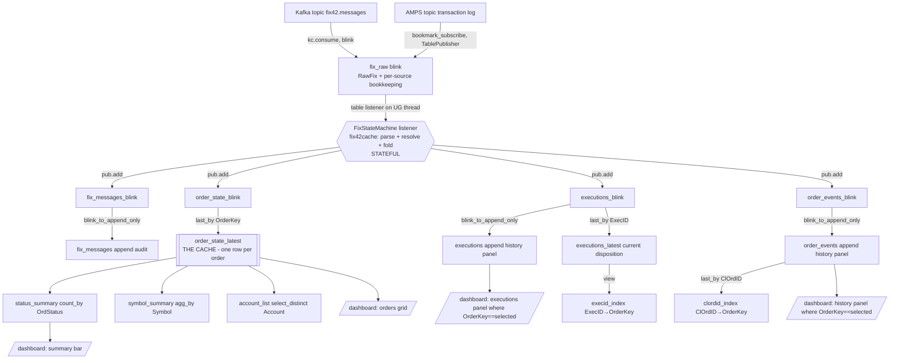

# Deephaven DAG Design

The TODO asks: *what should the DAG structure be in Deephaven?* Deephaven's update
graph **is** a DAG: source nodes tick, derived nodes recompute incrementally each
cycle. Our graph has one imperative/stateful node (the FIX state machine) bridged by
`TablePublisher`s; everything else is declarative.

## 1. The graph



## 2. Node-by-node specification

### 2.1 Source: `fix_raw` (blink)

Selected by `FIX42_SOURCE` — `kafka` (default) or `amps`. Both are the same contract:
**the topic is the journal, and it is replayed from the beginning on every boot**, so a
Deephaven restart rebuilds the identical cache (§3.3). Either way `fix_raw` is a blink
table and retains nothing.

Downstream never sees this table: §2.2's listener reads exactly one column, `RawFix`.
The other columns are per-source bookkeeping, and the two sources answer the same
question ("where in the journal did this row come from?") with different names —
`KafkaOffset` vs `AmpsBookmark`.

**`kafka`** — `dh_app.ingest.build_kafka_fix_raw`:

```python
fix_raw = kc.consume(
    {"bootstrap.servers": KAFKA_BOOTSTRAP, "group.id": "dh-fix42-dashboard"},
    topic="fix42.messages",
    offsets=kc.ALL_PARTITIONS_SEEK_TO_BEGINNING,   # replay = deterministic rebuild
    key_spec=kc.simple_spec("ChainKey", dht.string),
    value_spec=kc.simple_spec("RawFix", dht.string),
    table_type=kc.TableType.blink(),
)
```

Columns `KafkaPartition, KafkaOffset, KafkaTimestamp, ChainKey, RawFix`. Per-order
ordering holds because the producer keys by chain, so one order's whole life sits in
one partition and arrives in offset order.

**`amps`** — `dh_app.amps_ingest.build_amps_fix_raw`:

```python
client = AMPS.HAClient("dh-fix42-dashboard")          # memory bookmark store by default
client.set_server_chooser(chooser)                    # one add() per FIX42_AMPS_URI
client.connect_and_logon()
client.bookmark_subscribe(on_message, topic, AMPS.Client.Bookmarks.EPOCH, filter)
```

Columns `RawFix, AmpsBookmark, IngestTs`. `EPOCH` is the AMPS analogue of
seek-to-beginning: the subscription replays the whole transaction log and then cuts
over to live messages *on the same subscription*, so there is no replay/live seam to
get wrong. Ordering is the transaction log's own sequence — a single total order per
topic, which is stronger than Kafka's per-partition guarantee and does not depend on
how the publisher keyed anything.

The bridge from the AMPS client thread to the update graph:

```
  AMPS reader thread            RawBuffer            update-graph thread
  ------------------            ---------            -------------------
  on_message(msg) ---offer---> [rows] ---drain---> on_flush -> publisher.add(batch)
```

`table_publisher`'s `on_flush_callback` fires once at the start of each update graph
cycle and exists for exactly this ("allows publishers to add any data they may have
been batching"), so the reader thread only appends to a list and one table is built per
cycle on the update-graph thread. Four consequences worth stating:

- **Backpressure, not loss.** `RawBuffer.offer` blocks when full rather than dropping.
  A dropped message would break an amend chain silently, with nothing downstream able
  to notice; blocking the AMPS reader thread is ordinary TCP backpressure.
- **Bookmarks are discarded as they are buffered.** Without the discard, an HA
  reconnect replays from the oldest undiscarded bookmark — the whole journal, on every
  blip. Losing the buffer means the process died, and a fresh process starts with an
  empty memory bookmark store and replays from `EPOCH` anyway.
- **Cold start replays, a reconnect resumes.** The memory bookmark store is empty at
  process start (→ full replay, §3.3) but populated mid-life (→ resume at the last
  bookmark, no gap and no re-replay). Duplicates from a resume are absorbed by the same
  idempotence §3.3 relies on.
- **The client's lifetime is the server's.** It runs inside the Deephaven process, so
  there is no "restart the connector when Deephaven restarts" problem — unlike the
  out-of-process `:amps-connectors` app, which needs a generation check for exactly
  that (doc 07 §6).

**Deployment caveat.** `amps-python-client` is a commercial binary wheel and is **not**
in `ghcr.io/deephaven/server` — the AMPS path needs it installed into the image
(`manylinux` x86_64 and aarch64 wheels are both on PyPI). `dh_app.ingest` and
`dh_app.amps_ingest` therefore import both `deephaven` and `AMPS` lazily: a Kafka
deployment never touches the AMPS import, and source selection stays unit-testable on
a bare python.

**Verified** against AMPS 5.3.5.135 and `amps-python-client` 5.3.5.7 on Deephaven 42.4:
an `EPOCH` `bookmark_subscribe` over a journalled `fix` topic replayed 25 execution
reports, all 25 published in one flush (`dropped=0`, `waits=0`), folded to 25 rows in
`executions` and 7 in `order_state_latest`. A second cold source over the same journal
produced a byte-identical cache — the restart-determinism contract of §3.3, on the AMPS
side. Two things stay deployment-specific and were **not** verified: the filter syntax,
and the `sow_and_subscribe` alternative for a non-journalled topic.

One interop note from that run: AMPS `fix`-typed messages arrive as **bodies only** —
no `8=FIX.4.2` header and no `10=` checksum. `fix42cache.parser` is lenient by contract
(doc 01 §1: framing "is routinely stripped or rewritten", so checksum validity is
recorded rather than enforced), so those parse unchanged. A stricter parser would not.

### 2.2 Stateful node: the state-machine listener

- One `fix42cache.state_machine.OrderStateMachine` instance (single-threaded — the
  update graph delivers updates serially, so no locking needed).
- `deephaven.table_listener.listen(fix_raw, on_update)`; in `on_update`, read added
  rows (`update.added()` → column arrays), for each `RawFix`: `machine.process(raw)`
  returning a `Result` (state snapshot row + 0..n execution rows + 0..n event rows +
  1 message row). Batch rows per update cycle, then `publisher.add(new_table([...]))`
  once per publisher per cycle (batching matters for throughput).
- **Execution context:** creating tables on the listener thread requires the captured
  context: `ctx = get_exec_ctx()` at setup; `with ctx:` inside `on_update`.
- **Ordering guarantee:** rows arrive in journal order within and across cycles, so
  per-order message ordering holds — by partition + producer keying on Kafka, by the
  transaction log's own sequence on AMPS (§2.1).
- Failure policy: a message that throws is logged to an `errors` publisher
  (RawFix + exception) and skipped — the dashboard must survive malformed input.

### 2.3 Publishers (blink sources)

`deephaven.stream.table_publisher.table_publisher(name, {col: dtype, ...})` →
`(blink_table, publisher)`. Four streams: `fix_messages_blink`, `order_state_blink`,
`executions_blink`, `order_events_blink` (+ `ingest_errors`). Schemas: doc 01 §4/§6.

### 2.4 Derived nodes (declarative)

```python
order_state_latest = order_state_blink.last_by("OrderKey")          # THE cache
executions        = blink_to_append_only(executions_blink)          # panel history
executions_latest = executions_blink.last_by("ExecID")              # post bust/correct truth
order_events      = blink_to_append_only(order_events_blink)        # panel history
fix_messages      = blink_to_append_only(fix_messages_blink)        # audit

clordid_index = order_events.where("ClOrdID != ``").last_by("ClOrdID").view(["ClOrdID", "OrderKey"])
execid_index  = executions_latest.where("ExecID != ``").view(["ExecID", "OrderKey"])

status_summary  = order_state_latest.count_by("Count", by=["OrdStatus"]).sort(["OrdStatus"])
symbol_summary  = order_state_latest.agg_by(
    [agg.count_("Orders"), agg.sum_(["CumQty", "OrderQty"])], by=["Symbol"])
open_orders     = order_state_latest.where("!Terminal")
```

Why `last_by` over the **blink** stream for the cache: blink-aggregation semantics keep
exactly one latest row per OrderKey with O(#orders) memory (doc 02 §1.1). The same
`last_by` over the *append* table would give identical results but retain every
snapshot row upstream.

### 2.5 Query API (functions over the DAG)

Point lookups filter `order_state_latest`, resolving aliases through the index tables
first (details in doc 05 §4): `get_by_order_id`, `get_by_clordid`, `get_by_execid`,
`find_by_account`, `find_by_symbol`, `order_detail(order_key)` → (state, executions,
events) triple. Each returns a live filtered table (still a DAG node — callers can
subscribe) — snapshotting is the caller's choice.

### 2.6 Dashboard leaves (`deephaven.ui`)

A `ui.dashboard` with `use_state("selected OrderKey")`:
- **Orders panel**: `ui.table(order_state_latest_view, on_row_press=select)` — press a
  row → set selected OrderKey.
- **Executions panel**: `executions.where(f"OrderKey == `{sel}`")` (memoized).
- **History panel**: `order_events.where(...)` likewise.
- **Summary bar**: status counts; optional filters (Account/Symbol dropdowns feeding
  `where` on the orders panel).

The click-through requirement ("click on an order → executions + history panels") is
implemented purely as UI state driving `where` filters on the two append tables — the
DAG itself never changes shape at runtime.

## 3. Consistency & correctness notes

1. **Single-writer state:** only the listener mutates the state machine; the update
   graph serializes deliveries, so the fold is race-free without locks.
2. **Atomic per-cycle publishes:** all four publishers receive their rows inside the
   same update cycle as the source rows; downstream nodes therefore see a consistent
   frontier per cycle (Deephaven's update graph propagates each cycle atomically).
   Note `add()` calls are still four separate blink tables — cross-stream joins within
   one cycle are not needed anywhere in this design (each panel reads one stream).
3. **Replay-idempotent:** replay-from-the-beginning + idempotent id binding + ExecID
   dedupe ⇒ restarting Deephaven reproduces the identical cache (integration test
   asserts this). Both sources supply the replay: `ALL_PARTITIONS_SEEK_TO_BEGINNING` on
   Kafka, the `EPOCH` bookmark on AMPS (§2.1). Idempotence is also what makes an AMPS
   mid-life reconnect safe, since a bookmark resume may re-deliver.
4. **Backpressure:** parsing + fold is O(row); publishers batch per cycle. For the demo
   rates (hundreds–thousands msg/s) one listener is far below capacity.
5. **Late/duplicate data:** handled inside the state machine (doc 01 §5/§7), not in the
   DAG — DAG nodes stay purely functional over the published rows.
