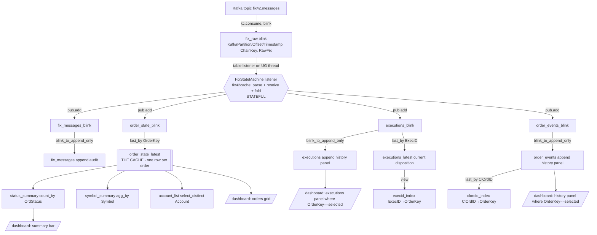

# Deephaven DAG Design

The TODO asks: *what should the DAG structure be in Deephaven?* Deephaven's update
graph **is** a DAG: source nodes tick, derived nodes recompute incrementally each
cycle. Our graph has one imperative/stateful node (the FIX state machine) bridged by
`TablePublisher`s; everything else is declarative.

## 1. The graph



## 2. Node-by-node specification

### 2.1 Source: `fix_raw` (blink)

```python
from deephaven.stream.kafka import consumer as kc
from deephaven import dtypes as dht

fix_raw = kc.consume(
    {"bootstrap.servers": KAFKA_BOOTSTRAP, "group.id": "dh-fix42-dashboard"},
    topic="fix42.messages",
    offsets=kc.ALL_PARTITIONS_SEEK_TO_BEGINNING,   # replay = deterministic rebuild
    key_spec=kc.simple_spec("ChainKey", dht.string),
    value_spec=kc.simple_spec("RawFix", dht.string),
    table_type=kc.TableType.blink(),
)
```

Seek-to-beginning makes restarts rebuild the full cache from the topic (the topic is
the journal). Per-order ordering is guaranteed because the producer keys by chain.

### 2.2 Stateful node: the state-machine listener

- One `fix42cache.state_machine.OrderStateMachine` instance (single-threaded — the
  update graph delivers updates serially, so no locking needed).
- `deephaven.table_listener.listen(fix_raw, on_update)`; in `on_update`, read added
  rows (`update.added()` → column arrays), for each `RawFix`: `machine.process(raw)`
  returning a `Result` (state snapshot row + 0..n execution rows + 0..n event rows +
  1 message row). Batch rows per update cycle, then `publisher.add(new_table([...]))`
  once per publisher per cycle (batching matters for throughput).
- **Execution context:** creating tables on the listener thread requires the captured
  context: `ctx = get_exec_ctx()` at setup; `with ctx:` inside `on_update`.
- **Ordering guarantee:** rows within one Kafka partition arrive in offset order within
  and across cycles, so per-order message ordering holds (producer keys by chain).
- Failure policy: a message that throws is logged to an `errors` publisher
  (RawFix + exception) and skipped — the dashboard must survive malformed input.

### 2.3 Publishers (blink sources)

`deephaven.stream.table_publisher.table_publisher(name, {col: dtype, ...})` →
`(blink_table, publisher)`. Four streams: `fix_messages_blink`, `order_state_blink`,
`executions_blink`, `order_events_blink` (+ `ingest_errors`). Schemas: doc 01 §4/§6.

### 2.4 Derived nodes (declarative)

```python
order_state_latest = order_state_blink.last_by("OrderKey")          # THE cache
executions        = blink_to_append_only(executions_blink)          # panel history
executions_latest = executions_blink.last_by("ExecID")              # post bust/correct truth
order_events      = blink_to_append_only(order_events_blink)        # panel history
fix_messages      = blink_to_append_only(fix_messages_blink)        # audit

clordid_index = order_events.where("ClOrdID != ``").last_by("ClOrdID").view(["ClOrdID", "OrderKey"])
execid_index  = executions_latest.where("ExecID != ``").view(["ExecID", "OrderKey"])

status_summary  = order_state_latest.count_by("Count", by=["OrdStatus"]).sort(["OrdStatus"])
symbol_summary  = order_state_latest.agg_by(
    [agg.count_("Orders"), agg.sum_(["CumQty", "OrderQty"])], by=["Symbol"])
open_orders     = order_state_latest.where("!Terminal")
```

Why `last_by` over the **blink** stream for the cache: blink-aggregation semantics keep
exactly one latest row per OrderKey with O(#orders) memory (doc 02 §1.1). The same
`last_by` over the *append* table would give identical results but retain every
snapshot row upstream.

### 2.5 Query API (functions over the DAG)

Point lookups filter `order_state_latest`, resolving aliases through the index tables
first (details in doc 05 §4): `get_by_order_id`, `get_by_clordid`, `get_by_execid`,
`find_by_account`, `find_by_symbol`, `order_detail(order_key)` → (state, executions,
events) triple. Each returns a live filtered table (still a DAG node — callers can
subscribe) — snapshotting is the caller's choice.

### 2.6 Dashboard leaves (`deephaven.ui`)

A `ui.dashboard` with `use_state("selected OrderKey")`:
- **Orders panel**: `ui.table(order_state_latest_view, on_row_press=select)` — press a
  row → set selected OrderKey.
- **Executions panel**: `executions.where(f"OrderKey == `{sel}`")` (memoized).
- **History panel**: `order_events.where(...)` likewise.
- **Summary bar**: status counts; optional filters (Account/Symbol dropdowns feeding
  `where` on the orders panel).

The click-through requirement ("click on an order → executions + history panels") is
implemented purely as UI state driving `where` filters on the two append tables — the
DAG itself never changes shape at runtime.

## 3. Consistency & correctness notes

1. **Single-writer state:** only the listener mutates the state machine; the update
   graph serializes deliveries, so the fold is race-free without locks.
2. **Atomic per-cycle publishes:** all four publishers receive their rows inside the
   same update cycle as the source rows; downstream nodes therefore see a consistent
   frontier per cycle (Deephaven's update graph propagates each cycle atomically).
   Note `add()` calls are still four separate blink tables — cross-stream joins within
   one cycle are not needed anywhere in this design (each panel reads one stream).
3. **Replay-idempotent:** seek-to-beginning + idempotent id binding + ExecID dedupe ⇒
   restarting Deephaven reproduces the identical cache (integration test asserts this).
4. **Backpressure:** parsing + fold is O(row); publishers batch per cycle. For the demo
   rates (hundreds–thousands msg/s) one listener is far below capacity.
5. **Late/duplicate data:** handled inside the state machine (doc 01 §5/§7), not in the
   DAG — DAG nodes stay purely functional over the published rows.
