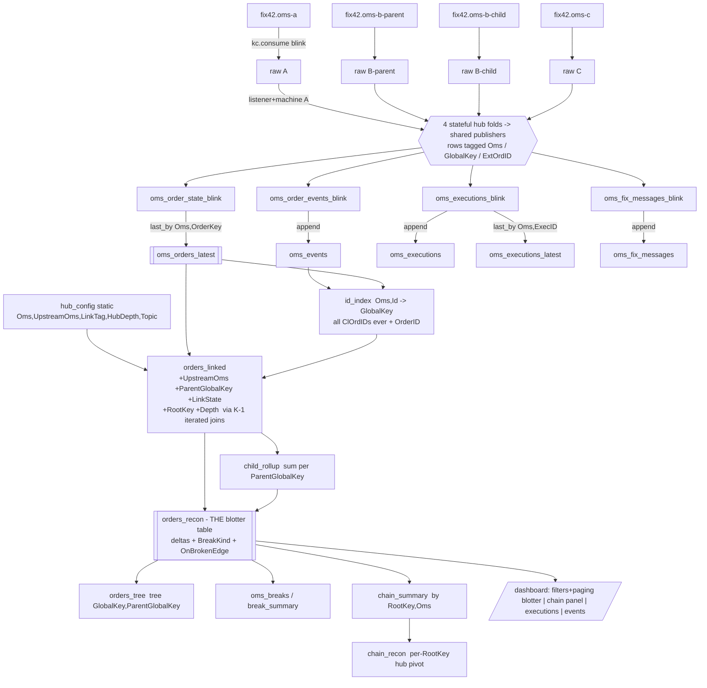

# Multi-OMS Drop-Copy Blotter (contract)

Design for the `deephaven-app-multi-oms-blotter` submodule: ingest FIX 4.2 drop-copy
streams from **several OMS hubs**, link orders across hubs through configurable
external-order-id tags, and reconcile each upstream order against the rollup of its
downstream children (`CumQty`, `LeavesQty`, notional = `AvgPx * CumQty`) so a break
can be traced to the system that owns it.

Sources of requirements, in precedence order:

1. [`deephaven-app-multi-oms-blotter/TODO.md`](../deephaven-app-multi-oms-blotter/TODO.md)
   — the assignment; explicitly allowed to deviate from the issue's UI sketch.
2. [Issue #10](https://github.com/crazymatthsu/deephaven-fix42-dashboard/issues/10)
   — flat blotter + chain panel, **per-edge** recon (never parent vs whole subtree),
   mismatches-only filter, works from either end of the chain.
3. Docs 00–07 — everything already frozen (row contracts, DAG conventions, app-mode
   packaging) is reused, not re-decided.

This doc is **binding** for the submodule the way docs 01/03/05 are for the FIX 4.2
dashboard: table names, column names, env vars and CLI flags below are frozen;
deviations must update this doc in the same change.

---

## 1. The problem, restated

Up to 4 OMS hubs each emit their own drop-copy tape (own `ClOrdID`/`OrderID`/`ExecID`
space, own lifecycle messages). The default topology is the TODO's:

```
OMS-A  ──►  OMS-B-parent  ──►  OMS-B-child (1..n per parent)  ──►  OMS-C (1 per child)
             16666=A.ClOrdID     16667=B-parent.ClOrdID           16668=B-child.ClOrdID
```

A downstream order's `D` carries a configured tag whose value is an identifier
(`ClOrdID` or `OrderID`) of its upstream order. Fan-out is one-parent-many-children.
Tag 1 on every order is the client account. The job:

- one blotter row per order per hub (flat, with an `Oms` column), filterable by
  account / symbol / side / source system(s), searchable by any id, paged;
- selecting any hop lights up the whole chain, both directions;
- per-edge reconciliation: parent's own `CumQty`/`LeavesQty`/notional vs the **sum
  over its direct children**, with a break taxonomy and a breaks-only view.

## 2. Analysis question 1 — python only, or python UI + java state machine?

**Decision: python-only, reusing `fix42cache` unchanged (one `OrderStateMachine`
instance per hub).** Reasoning, against doc 06's measured data:

1. **The new logic is declarative, not a fold.** Cross-hub linking, root resolution
   and per-edge rollups are joins/aggregations — they execute inside Deephaven's
   Java engine no matter which language scripts them. The only stateful work is the
   per-tape FIX fold, which already exists, adversarially tested, in `fix42cache`.
2. **Throughput budget holds.** Doc 06 measured ~23–24k msg/s for one python fold.
   Hubs are folded by independent machine instances over independent tapes; the
   drop-copy of one flow through 4 hubs ≈ 4× one tape's rate. Demo rates use <1% of
   the ceiling; the ~6k msg/s sustained recommendation now applies to the *sum over
   hubs*, which still covers moderate production drop-copy.
3. **The UI is the point of this module, and `deephaven.ui` is python-only.**
   Filters, paging, chain panel, break coloring — none of it has a Java surface.
4. **The escape hatch is already built.** `deephaven-app-java`'s `fixcache` is the
   same fold in Java behind the same frozen row contract; if a deployment needs it,
   each hub's fold can be swapped to a jpy-batched Java call without touching the
   linking DAG (doc 06 §3 option 1). Nothing in this module makes that harder.

A mixed build today would add an interop seam and a second artifact for zero
functional gain. Doc 06's decision rule stands, applied to the aggregate rate.

## 3. Configuration contract

All env vars, read once at app start:

| Variable | Default | Meaning |
|---|---|---|
| `MULTIOMS_HUBS` | *(the JSON below)* | topology: JSON array of hub objects |
| `MULTIOMS_KAFKA_BOOTSTRAP` | `kafka:9092` | broker for every hub topic |
| `MULTIOMS_QTY_TOL` | `1e-6` | absolute tolerance for qty deltas |
| `MULTIOMS_NOTIONAL_TOL` | `0.01` | absolute tolerance for notional deltas |
| `MULTIOMS_PAGE_SIZE` | `200` | blotter page size (UI default) |

Default `MULTIOMS_HUBS` (exactly the TODO's topology and tags):

```json
[
  {"name": "OMS-A",        "topic": "fix42.oms-a"},
  {"name": "OMS-B-parent", "topic": "fix42.oms-b-parent", "upstream": "OMS-A",        "link_tag": 16666},
  {"name": "OMS-B-child",  "topic": "fix42.oms-b-child",  "upstream": "OMS-B-parent", "link_tag": 16667},
  {"name": "OMS-C",        "topic": "fix42.oms-c",        "upstream": "OMS-B-child",  "link_tag": 16668}
]
```

Validation (startup error, not a silent fallback — same policy as `FIX42_SOURCE`):
unique names, unique topics, `upstream` must name another hub, `link_tag` present
iff `upstream` is, positive int, no cycles, at least one root. Each hub gets a
static `HubDepth` = distance from its root (root = 0). A hub has at most one
upstream; fan-out lives in the *orders*, not the hub graph.

`OMS-B-parent` vs `OMS-B-child` are deliberately modeled as **two hubs**: parent/child
inside OMS-B is the same edge shape as a cross-hub route (a configured tag naming
the upstream order), so one mechanism handles both, which is what the TODO's
"handle OMS-B's parent and child orders" plus "configurable external-order-id tag"
amounts to.

## 4. Ingestion and the stateful nodes

One `kc.consume` blink table **per hub topic** (same settings as doc 03 §2.1:
`ALL_PARTITIONS_SEEK_TO_BEGINNING`, key→`ChainKey`, value→`RawFix`, group id
`dh-multi-oms-<hub-name-lower>`), so a Deephaven restart deterministically rebuilds
the whole multi-hub cache. Kafka only for v1; the per-hub source builder is the
seam where an AMPS bookmark subscription would slot in exactly as doc 03 did it.

One **listener + `OrderStateMachine` per hub** — a deliberate, documented extension
of doc 00's "exactly one stateful node": it is one stateful node *per tape*, the
machines share nothing, and each is the same single-writer fold as before. Per raw
message the hub listener:

1. `fields = parse_fix(raw)` — parse **once**;
2. `ext = fields.get(link_tag, "")` (only hubs with an upstream extract anything);
3. `result = machine.process_fields(fields, raw)` — the unchanged fix42cache fold;
4. maintains the hub's **sticky link map** `{OrderKey: ExtOrdID}`: first non-empty
   link-tag value seen for the chain wins; later conflicting values are ignored
   (drop-copy links do not legitimately change; documented, not configurable);
5. publishes `result`'s rows into **shared publishers** (one set for the app), each
   row augmented with `Oms` and `GlobalKey = Oms + "|" + OrderKey`, and the state
   row also with the sticky `ExtOrdID`.

`fix42cache` is **not modified** — no doc 01 change, no java parity golden
regeneration. The sticky map is the only state this module adds, it is per-hub,
bounded by #orders, and lives in a pure-python helper (`multi_oms.linking`) so it
is unit-testable without Deephaven.

### 4.1 Published schemas (frozen)

Exactly the doc 01 §4/§6 schemas with these additions:

| Stream | Added columns |
|---|---|
| `oms_order_state_blink` | `Oms` (string), `GlobalKey` (string), `ExtOrdID` (string, `""` if none) |
| `oms_executions_blink` | `Oms`, `GlobalKey` |
| `oms_order_events_blink` | `Oms`, `GlobalKey` |
| `oms_fix_messages_blink` | `Oms` |
| `oms_ingest_errors` | `Oms` |

Added columns lead (before `OrderKey`). All other column names/types are byte-for-byte
doc 01's; the pipeline row-coercion rules are dh_app's (empty-string strings,
`NULL_DOUBLE`/`NULL_LONG`, tri-state booleans). The coercion/publisher helpers are
duplicated locally (~100 lines) rather than imported from `dh_app.pipeline`
internals, honoring the module-ownership convention (doc 05 §8).

## 5. Analysis question 2 — the DAG



### 5.1 Caches and history (per doc 02 semantics)

```python
oms_orders_latest     = oms_order_state_blink.last_by(["Oms", "OrderKey"])   # THE cache
oms_executions        = blink_to_append_only(oms_executions_blink)
oms_executions_latest = oms_executions_blink.last_by(["Oms", "ExecID"])
oms_events            = blink_to_append_only(oms_order_events_blink)
oms_fix_messages      = blink_to_append_only(oms_fix_messages_blink)
```

Executions and events stay **per hop** (issue #10: quantities are never summed
across hubs in the history panels — only the recon columns roll up).

### 5.2 Identifier resolution across hubs

The link value may be the upstream order's `ClOrdID` **or** `OrderID`, and an amend
rotates `ClOrdID` — so the index must cover every id ever seen, exactly like doc
03's `clordid_index` trick, but namespaced by hub:

```python
clordid_ids = oms_events.where("ClOrdID != ``") \
    .view(["Oms", "Id = ClOrdID", "GlobalKey"]).last_by(["Oms", "Id"])
orderid_ids = oms_orders_latest.where("OrderID != ``") \
    .view(["Oms", "Id = OrderID", "GlobalKey"])
id_index = merge([clordid_ids, orderid_ids]).last_by(["Oms", "Id"])   # (Oms, Id) -> GlobalKey
```

A `ClOrdID` colliding with an `OrderID` string *within one hub* would resolve to the
later writer; id schemes make this implausible and it is documented, not defended.

### 5.3 Linking, roots, depth

`hub_config` is a tiny static table built from the topology (`Oms`, `UpstreamOms`
(`""` for roots), `LinkTag`, `HubDepth`, `Topic`) — also exported as a panel so the
running config is visible.

```python
linked = oms_orders_latest.natural_join(hub_config, on=["Oms"], joins=["UpstreamOms", "HubDepth"]) \
    .natural_join(id_index, on=["UpstreamOms=Oms", "ExtOrdID=Id"], joins=["ParentGlobalKey=GlobalKey"]) \
    .update_view(["LinkState = ExtOrdID == `` ? (UpstreamOms == `` ? `ROOT` : `NO_LINK`)"
                  " : (ParentGlobalKey == null ? `DANGLING` : `LINKED`)",
                  "Notional = (isNull(AvgPx) ? 0.0 : AvgPx) * (isNull(CumQty) ? 0.0 : CumQty)"])
```

`Notional` is defined here (not in `orders_recon`) because `child_rollup` sums it
and is built from `orders_linked`. `hub_config.LinkTag` is `0` for root hubs — not
a legal FIX tag, so unambiguous.

```python
```

Transitive root + depth by **K−1 iterated joins** (K = #hubs; bounded, static DAG):

```python
parent_map = linked.view(["GlobalKey", "ParentGlobalKey"])
t = linked.update(["RootKey = ParentGlobalKey == null ? GlobalKey : ParentGlobalKey",
                   "Depth = ParentGlobalKey == null ? 0 : 1"])
for _ in range(len(hubs) - 1):
    t = t.natural_join(parent_map, on=["RootKey=GlobalKey"], joins=["NextUp=ParentGlobalKey"]) \
         .update(["Depth = NextUp == null ? Depth : Depth + 1",
                  "RootKey = NextUp == null ? RootKey : NextUp"]).drop_columns(["NextUp"])
orders_linked = t
```

`RootKey` is the **chain id**: every member of a family shares it, which is what
makes "select any hop, see the whole chain, both directions" a single `where`.
A `DANGLING`/`NO_LINK` order is its own root until (unless) its parent appears —
arrival order across independent hub topics is unordered by nature, and a late
parent *heals* the family incrementally with no replay. Config bounds depth, so a
data cycle cannot loop — it just stops resolving past K hops.

### 5.4 Per-edge reconciliation (the rollup)

Issue #10 is explicit: compare **each edge** — a parent vs the sum of its direct
children — never a hop vs the whole subtree (double-counts mid hops), and never
write child rollups over per-hop authoritative values. So:

```python
child_rollup = orders_linked.where("ParentGlobalKey != null").agg_by(
    [agg.count_("ChildCount"),
     agg.sum_(["ChildOrderQty = OrderQty", "ChildCumQty = CumQty",
               "ChildLeavesQty = LeavesQty", "ChildNotional = Notional"])],
    by=["ParentGlobalKey"])

orders_recon = orders_linked \
    .natural_join(child_rollup, on=["GlobalKey=ParentGlobalKey"],
                  joins=["ChildCount", "ChildOrderQty", "ChildCumQty", "ChildLeavesQty", "ChildNotional"]) \
    .update_view([
        "HasChildren = !isNull(ChildCount)",
        "DeltaCumQty = HasChildren ? CumQty - ChildCumQty : NULL_DOUBLE",
        "DeltaLeavesQty = HasChildren ? LeavesQty - ChildLeavesQty : NULL_DOUBLE",
        "DeltaNotional = HasChildren ? Notional - ChildNotional : NULL_DOUBLE",
        "EdgeBreak = HasChildren && (abs(DeltaCumQty) > QTY_TOL || abs(DeltaNotional) > NOTIONAL_TOL)",
    ])
# second pass: child side of a broken edge + classification
orders_recon = orders_recon.natural_join(
        orders_recon.view(["GlobalKey", "ParentEdgeBreak = EdgeBreak"]),
        on=["ParentGlobalKey=GlobalKey"], joins=["ParentEdgeBreak"]) \
    .update_view([
        # ParentEdgeBreak is a boxed Boolean, null for roots/orphans -- guard the unboxing:
        "OnBrokenEdge = EdgeBreak || (!isNull(ParentEdgeBreak) && ParentEdgeBreak)",
        "BreakKind = (LinkState == `DANGLING` || LinkState == `NO_LINK`) ? LinkState"
        " : (HasChildren && abs(DeltaCumQty) > QTY_TOL) ? `QTY_BREAK`"
        " : (HasChildren && abs(DeltaNotional) > NOTIONAL_TOL) ? `NOTIONAL_BREAK`"
        " : (HasChildren && abs(DeltaLeavesQty) > QTY_TOL) ? `UNROUTED`"
        " : `NONE`",
    ])
```

Break semantics (the taxonomy the UI colors by):

| `BreakKind` | Meaning | Severity |
|---|---|---|
| `QTY_BREAK` | parent `CumQty` ≠ Σ children `CumQty` — fills disagree; a tape missed/extra an execution | red |
| `NOTIONAL_BREAK` | quantities agree but `AvgPx·CumQty` doesn't — a bust/correct propagated wrong | red |
| `DANGLING` | link value doesn't resolve on the upstream hub (drop-copy gap or bad reference) | red |
| `NO_LINK` | hub requires a link tag and the order never carried one | red |
| `UNROUTED` | quantities agree; `LeavesQty` gap = qty open upstream not open downstream (unrouted / in-flight) | amber |
| `NONE` | edge reconciles (or leaf order with a healthy parent edge) | quiet |

`DeltaLeavesQty ≠ 0` alone is deliberately **not** red: with clean fills it is
exactly the unrouted remainder, which the issue names "unrouted / in-flight /
break" — the qty/notional deltas are what distinguish a true break.

### 5.5 Rollup views

```python
oms_breaks    = orders_recon.where("BreakKind != `NONE` && BreakKind != `UNROUTED`")
break_summary = orders_recon.where("BreakKind != `NONE`").count_by("Count", by=["Oms", "BreakKind"])
chain_summary = orders_recon.agg_by(
    [agg.count_("Orders"), agg.sum_(["CumQty", "LeavesQty", "Notional", "OrderQty"]),
     agg.max_(["MaxBreak = OnBrokenEdge"])], by=["RootKey", "Oms"])
```

`chain_recon` pivots `chain_summary` per `RootKey` into one row per family with
per-hub columns (`Orders_<HUB>`, `CumQty_<HUB>`, `LeavesQty_<HUB>`, `Notional_<HUB>`
— hub name sanitized to `[A-Za-z0-9_]`), built by iterated `natural_join`s over the
configured hubs, plus per-edge booleans `QtyBreak_<childHub>`/`NotionalBreak_<childHub>`
comparing each configured hub edge's level sums (absent levels compare as
no-break), and OR'd aggregates `QtyBreak`/`NotionalBreak`. Level sums *are* comparable per chain (each hub reports the
same economic flow), and the pivot answers "which chain, and between which two
systems" at a glance; the per-order rows then localize the exact edge.
`break_summary` answers "which **system** has breaks" directly.

`orders_tree = orders_recon.tree("GlobalKey", "ParentGlobalKey", promote_orphans=True)`
is exported as a global: the native hierarchical panel gives the expand/collapse
upstream→downstream view (fan-out as child nodes) with the recon columns on every
node — the "better way to display" the TODO invites, without betting the dashboard
on it (issue #10's caveats about tree selection stand, so the `deephaven.ui`
dashboard keeps a flat blotter and `orders_tree` is a companion panel).

## 6. Dashboard (`multi_oms_blotter`)

`deephaven.ui`, one dashboard global, defensive to plugin absence/API drift exactly
like `dh_app.dashboard` (lazy import → `None` fallback, signature-agnostic
`on_row_press`, `_safe()` around optional widgets). Layout:

```
┌───────────────────────────────────────────────────────────────────────────┐
│ Account ▾  Symbol ▾  Side ▾  [x]OMS-A [x]OMS-B-parent [x]… [ ]breaks only │
│ search: [ClOrdID/OrderID/ext id]     ◀ Prev   page 1/12   Next ▶  (200/pg)│
├──────────────────────────────────────────────┬────────────────────────────┤
│ Blotter (flat, paged)                        │ Chain panel                │
│ Oms|ClOrdID|OrderID|LinkState|Acct|Sym|Side  │ family of selected row:    │
│ |OrdStatus|Qty|Cum|Leaves|AvgPx|Notional     │ where RootKey==sel, sorted │
│ |Children|ΔCum|ΔLeaves|ΔNotional|BreakKind   │ by Depth,Oms — every hop,  │
│  (row press → select GlobalKey+RootKey)      │ Δ columns colored          │
├──────────────────────────────────────────────┼────────────────────────────┤
│ Executions of selected hop (per-hub tape)    │ Order events of selected   │
└──────────────────────────────────────────────┴────────────────────────────┘
```

- **Filters** (all optional, combinable): Account and Symbol as pickers fed by
  `account_list` / `symbol_list` (type-in via `ui.combo_box` where the pinned
  plugin supports it, `ui.picker` fallback); Side picker (`BUY`/`SELL`/`SELL_SHORT`);
  source systems as one checkbox per configured hub (multi-select — "one or more
  source systems"); **breaks only** checkbox filtering to `OnBrokenEdge ||
  BreakKind != NONE`; free-text search over `ClOrdID`/`OrderID`/`ExtOrdID`/
  `GlobalKey` (`contains`, sanitized through `sanitize_id`).
- **Paging**: Deephaven grids already virtualize the viewport, but the blotter
  additionally hard-pages per the TODO: filtered table sorted by
  `[RootKey, Depth, Oms, OrderKey]`, then `.slice(page*size, (page+1)*size)`;
  Prev/Next buttons, live `rows X–Y of N` from a `count_by` via `use_cell_data`
  (fallback: static size), page resets to 0 on any filter change; page size from
  `MULTIOMS_PAGE_SIZE`.
- **Selection**: row press stores `(GlobalKey, RootKey)`; chain panel filters on
  `RootKey`, bottom panels on `GlobalKey` — selecting an upstream or downstream
  hop both light the whole family (issue's "works both ways"). Pressing a chain
  panel row re-centers the selection the same way. Both tables pass
  `always_fetch_columns=["GlobalKey", "RootKey"]`: the two key columns trail the
  display columns and are outside the viewport in a narrow panel, and
  `deephaven.ui` 0.40 (the version pinned in `ghcr.io/deephaven/server:42.4`)
  delivers only viewport columns to `on_row_press` unless they are named there,
  so without it a click on a narrow blotter silently selects nothing. The call is
  wrapped in `_first()` with a plain `ui.table(...)` fallback for plugin builds
  that predate the keyword.
- **Coloring**: server-side `format_columns`/`format_row_where` (stable Table API)
  — red for `QTY_BREAK`/`NOTIONAL_BREAK`/`DANGLING`/`NO_LINK`, amber for
  `UNROUTED`, applied inside `_safe`.

Every table above is also exported as a plain global, so the app degrades to
individual panels when `deephaven.ui` is unavailable, doc 03 §2.6 style.

## 7. Query API (globals, all returning live tables)

| Function | Behavior |
|---|---|
| `find_chain(any_id)` | resolve `any_id` through `id_index` across **all** hubs → the full family rows from `orders_recon` (all matching RootKeys), sorted by `[RootKey, Depth, Oms, OrderKey]` so families never interleave |
| `get_order(oms, any_id)` | one hub's order by any of its ids |
| `find_by_account(a)` / `find_by_symbol(s)` | filtered `orders_recon` |
| `hub_orders(oms)` | one hub's blotter rows |
| `breaks_only()` | `orders_recon` filtered to `BreakKind != NONE` |
| `order_detail(global_key)` | `{"state", "executions", "events"}` for one hop |

All ids pass through `sanitize_id` (same rules as `dh_app.query_api`).

## 8. Mock generator — multi-OMS mode (`:fix-mock-generator`)

Extends the existing module (reusing `FixMessage`/`FixSerializer`/`KafkaFixPublisher`;
the publisher gains a per-message-topic `publish(topic, key, value)` overload). New
`--multi-oms` mode generates **correlated tapes** for the default 4-hub topology
(topics as §3) — each hub tape a self-consistent doc 01 lifecycle, keyed per hub by
that hub's chain key, fills propagating upstream with identical absolute snapshots
unless a scenario injects a break.

| Scenario | Script | Expected recon |
|---|---|---|
| `clean_fill` | full route A→Bp→Bc(×k)→C, fills to `FILLED` at every level | all `LINKED`, all deltas 0 |
| `working_fanout` | full route, partial fills still working | `LINKED`, deltas 0 (leaves consistent at every edge) |
| `partial_route` | parent routes only part of qty; routed part fills | `UNROUTED` (amber) at the partially-routing hop; no red |
| `missed_fill` | the OMS-B-parent tape omits its **final** execution report (a middle one would self-heal: 14/151/6 are absolute snapshots, so the next report restates the truth) | `QTY_BREAK` on the OMS-A and OMS-B-parent rows; B-parent ends `PARTIALLY_FILLED` short |
| `dangling_child` | an OMS-C `D` references a B-child id that never exists | `DANGLING` on that order |
| `late_parent` | B-parent tape published after child/C tapes | transient dangle, final state `LINKED`, no break |

CLI: `--multi-oms` plus the existing `--orders/--seed/--rate/--scenario/--loop/
--dry-run/--list-scenarios/--emit-expected/--bootstrap-servers`; new `--children N`
(max fan-out per parent, default 3). `--topic` is **rejected** in multi-OMS mode
with an actionable error (the topology fixes per-hub topics; silently ignoring a
flag would hide a mistake). Deterministic per seed. No scenario produces a
notional-only break (every fill executes at the family limit price, so `AvgPx`
matches wherever `CumQty` does); the `NOTIONAL_BREAK` classification itself is
covered by unit tests on the taxonomy. `--emit-expected` writes one
JSON object **per hub-order**: `Oms`, `ClOrdID` (the D's — equals `OrderKey`),
`OrderID`, `ExtOrdID`, `GlobalKey`, `RootGlobalKey`, `Scenario`, `OrdStatus`,
`CumQty`, `LeavesQty`, `AvgPx`, `LinkState`, `BreakKind` — computed by the
generator's own edge math, which is what the e2e asserts against.

JUnit coverage: link-tag wiring (`16667` = parent's `ClOrdID`, …), qty conservation
per clean scenario at every edge, the injected discrepancy of `missed_fill`,
determinism (same seed ⇒ identical streams), per-tape monotone times, serializer
framing on every emitted message.

## 9. Deployment

- **New app folder** `docker/apps/multi-oms-blotter/` (`.app` id
  `fix42.multi.oms.blotter`, `main.py` → loader → `/moms-scripts/multi_oms/app.py`),
  selected with `DH_APP=multi-oms-blotter`.
- **Compose**: add read-only mount `../deephaven-app-multi-oms-blotter/src:/moms-scripts:ro,z`
  (harmless to other apps); `PYTHONPATH` becomes `/scripts:/moms-scripts` (belt and
  braces; `main.py`/`app.py` also bootstrap `sys.path` for both dirs so console
  re-exec works); the kafka **healthcheck pre-creates the four hub topics** next to
  `fix42.messages` — load-bearing for the same reason as before (`kc.consume`
  resolves partitions once at startup; doc 05 §5).
- **Gradle**: `settings.gradle.kts` gains `include(":deephaven-app-multi-oms-blotter")`;
  the module wraps its pytest suite exactly like `:deephaven-scripts`
  (`base` plugin, `pytest` Exec task via `run_tests.sh`, wired into `check`).

## 10. Module layout & testing

```
deephaven-app-multi-oms-blotter/
├── TODO.md                     # the assignment (kept)
├── README.md                   # runbook: stack up, generate, open, reconcile
├── build.gradle.kts            # base + pytest task (mirrors deephaven-scripts)
├── run_tests.sh / pyproject.toml   # package multi_oms; stdlib + pytest only
├── src/multi_oms/
│   ├── config.py               # pure: topology parse/validate, HubConfig, depths, tolerances
│   ├── linking.py              # pure: sticky LinkTracker, global_key(), name sanitizing, row augmentation
│   ├── ingest.py               # per-hub kc.consume builders (lazy deephaven import; config funcs pure)
│   ├── pipeline.py             # shared publishers + one hub listener each (adapter only, no FIX logic)
│   ├── dag.py                  # §5 nodes: build_derived(topology, streams)
│   ├── query_api.py            # §7
│   ├── dashboard.py            # §6
│   └── app.py                  # entrypoint: sys.path bootstrap (/scripts + /moms-scripts),
│                               #   wire, export globals, banner; idempotent re-exec
├── tests/                      # pytest: config validation, LinkTracker, row augmentation,
│                               #   ingest config selection, key/sanitize helpers, paging math
└── e2e/
    ├── run_e2e.sh              # down -v → up (DH_APP=multi-oms-blotter) → generator --multi-oms
    │                           #   --seed 42 --emit-expected → pytest → down (KEEP_STACK honored)
    └── test_blotter_e2e.py     # pydeephaven assertions (below); skips cleanly without a stack
```

The §5 builders are also exported under public names (`hub_config_table`, `build_id_index`,
`build_orders_linked`, `build_child_rollup`, `build_orders_recon`, `build_chain_summary`,
`build_chain_recon`) because the doc 10 collector runs the same linking/recon over rows merged
from several servers — one implementation of these semantics, not two.

Unit tests cover every pure module; `deephaven`-importing modules follow the
dh_app precedent (integration-tested, not pytest-mocked). The e2e (self-contained
here; `integration-test/` is not touched — a fix to its runner is in flight on
another branch) asserts:

1. every §5 global exists (tree checked via `run_script`, not `open_table` — a
   hierarchical table is not a plain-table ticket);
2. per hub-order final `CumQty`/`LeavesQty`/`OrdStatus`/`ExtOrdID`/`LinkState`
   match the generator's expected export, keyed by (`Oms`, `ClOrdID`);
3. clean/`working_fanout`/`late_parent` families: root hop `ROOT`, every downstream
   hop `LINKED` (the §5.3 formula — a root-hub order is never `LINKED`), absent from
   `oms_breaks`; `late_parent` proves out-of-order arrival healed;
4. `missed_fill` shows `QTY_BREAK` at the expected hub row; `dangling_child` shows
   `DANGLING`; `partial_route` shows `UNROUTED` and is **not** in `oms_breaks`;
5. `find_chain` from an OMS-C id returns the whole ≥4-hop family (works both ways);
6. restart resilience: restart the Deephaven container, cache and recon rebuild
   identically (topic-as-journal, doc 03 §3.3 — per-order assertions, not counts).

Always `down -v` before the suite (dirty-topic replays converge per-chain but a
previous different-seed run leaves extra families; per-key assertions plus a clean
volume keep it deterministic).

## 11. Division of labor

| Agent | Owns (exclusively) | Contract |
|---|---|---|
| A | `deephaven-app-multi-oms-blotter/` (all but `e2e/`), `docker/apps/multi-oms-blotter/`, compose + `settings.gradle.kts` edits | §3–§7, §9 |
| B | `fix-mock-generator/` multi-OMS extension | §8 |
| C (after A+B) | `deephaven-app-multi-oms-blotter/e2e/`, README updates (submodule + root), doc index rows | §10 |

Shared truth = this doc. No agent edits another's files.
