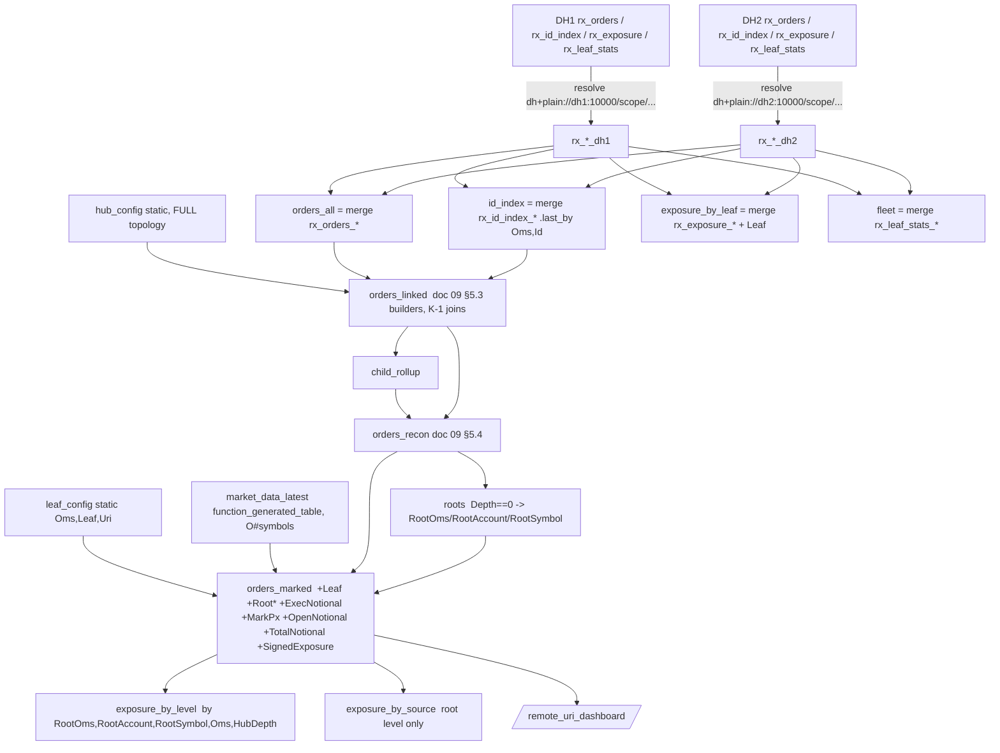

# Multi-server Deephaven — remote-URI leaves and collector (contract)

Design for the `deephaven-remote-uri` submodule: the doc 09 multi-OMS order flow spread across
**several Deephaven servers** (`DH1..DHn`, the *leaves*), each folding a subset of the OMS hub
tapes read from **AMPS**, plus a **collector** server that holds only a *subset* of the leaves'
data — acquired through Deephaven's remote-table mechanisms (`deephaven.uri` / Barrage
subscriptions for push, Barrage snapshots and remote console execution for pull) — re-links the
cross-hub families, joins a market-data table and answers: *given a source OMS, a client account
and a symbol, show every hop upstream → downstream with the latest `CumQty`, `LeavesQty` and
notional exposure.* It also carries the sizing analysis for **400M FIX messages**
(`35=D,G,F,8,9,Q`) across such a fleet.

Sources of requirements, in precedence order:

1. The assignment (2026-09-01): "multiple Deephaven instances (DH1, DH2, … DHn) receive data from
   AMPS; a DH-collector collects and combines the leaf DAG table data — a subset, for in-memory
   management; analyze the orchestration topology and how to process 400 million FIX messages
   (35=D,G,F,8,9,Q); the collector must take a source OMS name, client account and symbol and
   return the full upstream-to-downstream latest order states (total CumQty, LeavesQty, notional
   exposure) against a market-data table; demo remote calls and remote subscriptions."
2. Decisions taken with the user the same day: chain lineage per doc 09 (leaves sharded by OMS
   hub); the demo runs **2 leaves + collector**; the generator gains an `--amps-uri` mode; market
   data is simulated inside the collector; python only.
3. Docs 00–09 — everything already frozen (row contracts, doc 09's linking and reconciliation,
   app-mode packaging, `FIX42_*`/`MULTIOMS_*` conventions) is reused, not re-decided.

This doc is **binding** for the submodule the way doc 09 is for the multi-OMS blotter: table
names, column names, env vars and CLI flags below are frozen; deviations must update this doc in
the same change.

---

## 1. The problem, restated

One client flow is routed through four OMS hubs (`OMS-A → OMS-B-parent → OMS-B-child (1..n) →
OMS-C`), each hub emitting its own drop-copy tape linked to its upstream order by a configured
tag (doc 09 §1). In doc 09 all four tapes are folded in one server. Here:

- every hub tape is an **AMPS journalled topic** (`fix42.oms-a`, `fix42.oms-b-parent`,
  `fix42.oms-b-child`, `fix42.oms-c`), published by the mock generator;
- each **leaf** server subscribes to the tapes of the hubs assigned to it, folds them with the
  unchanged `fix42cache` state machine (one per hub, via `multi_oms.pipeline`), keeps the per-hub
  caches, and **exports** a narrow projection plus aggregates;
- the **collector** subscribes remotely to every leaf's exports, merges them, runs doc 09's
  cross-hub linking and per-edge reconciliation over the union, marks open quantity against a
  market-data table and serves the (source OMS, account, symbol) lookup as tables, a query API
  and a `deephaven.ui` dashboard; per-order history (executions) is fetched from the owning leaf
  **on demand** by a remote call.

The demo topology (§11) is `DH1 = OMS-A`, `DH2 = OMS-B-parent + OMS-B-child + OMS-C`,
`collector`; `DHn` is one more compose block and one more JSON entry.

## 2. Analysis — orchestration topology and 400 million messages

### 2.1 What is distributed, and why the partition is the server

The only stateful node in the whole design is the per-tape FIX fold (doc 00's hybrid-DAG
decision): a message can only be applied by the machine that holds its chain (`ClOrdID` →
`OrigClOrdID` amend chains, late `OrderID`, per-request reject reverts, `ExecID` dedupe).
Everything after the fold — `last_by`, `natural_join`, `agg_by` — is declarative and can run
anywhere the rows are. Two consequences drive the topology:

1. **A chain never spans two folds**, so the unit of distribution is a *tape* (an AMPS topic, or
   a hash bucket of one — §2.2). A leaf owns whole tapes.
2. **Cross-hub links do not need co-location.** Linking is a join on
   `(UpstreamOms, ExtOrdID) → GlobalKey` (doc 09 §5.3); the collector performs it over the union
   of the leaves' `rx_orders`/`rx_id_index` exports, so an `OMS-C` order on `DH2` links to its
   `OMS-A` ancestor on `DH1` exactly as it would inside one server. A parent that has not arrived
   yet is `DANGLING` and heals to `LINKED` — no replay, no coordination.

Doc 02 §1.5 rejected Deephaven partitioned tables *within* one server; here the partition is a
JVM, which is the only way to grow the fold's single-thread budget (§2.3) and the resident cache
(§2.4) together.

### 2.2 Sharding rule

```
shard      = (hub, bucket)          bucket = hash(chainKey) mod k, k = 1 in the demo
AMPS topic = fix42.<hub>            (k = 1)   or   fix42.<hub>.s<bucket>   (k > 1)
leaf       = a set of shards        REMOTEURI_LEAF_HUBS (k = 1)  /  regex topic ^fix42\.oms-a(\.s[0-9]+)?$
collector  = the union of all leaves
```

- The **publisher** decides the bucket from the chain key (the generator already keys every
  message by chain — the Kafka key of doc 00 §5), so a chain lands on exactly one topic. This is
  the same partitioning Kafka does by key, expressed as an AMPS topic suffix.
- A leaf subscribes to each of its shards with one `bookmark_subscribe` (AMPS accepts a regex
  topic per subscription), so adding a shard to a leaf is configuration, not code.
- **Rebalancing** a shard between leaves = stop its fold on the old leaf, start it on the new
  one from `EPOCH` (the AMPS journal is the source of truth), reconnect the collector. No state
  is copied between leaves — ever.
- v1 implements `k = 1` (one topic per hub, `--amps-uri` in the generator); `--amps-shards k` and
  the regex leaf subscription are specified here and deferred (§10).

### 2.3 Throughput — how long 400M messages take

Doc 06 measured the python fold at **~23–24k msg/s ceiling** and recommends **~6k msg/s
sustained** per update-graph thread (`fold+rows`, in-container, one core). Every hub listener
on a leaf runs on that leaf's *one* update-graph thread, so the budget is per **leaf**, not per
hub (doc 09 §2 applied to a server).

| Leaves N | Replay 400M at the 23k ceiling | Replay at 6k sustained | Live capacity at 6k/leaf |
|---|---|---|---|
| 1 | 4.8 h | 18.5 h | 6k msg/s |
| 4 | 1.2 h | 4.6 h | 24k msg/s |
| 8 | 36 min | 2.3 h | 48k msg/s |
| 16 | 18 min | 1.2 h | 96k msg/s |
| 32 | 9 min | 35 min | 192k msg/s |

400M messages per trading day is **4.6k msg/s on average**; with the usual ~10× open/close
peaks (~46k msg/s) that is **8 leaves** at the sustained recommendation, 2 at the ceiling with no
headroom. The lever if N must stay small is the fold itself: `deephaven-app-java`'s `fixcache` is
the same fold in Java behind the same row contract (doc 06 §3; unmeasured, expected ≥10×), and
the leaf's `MultiOmsPipeline` is the seam where it plugs in. AMPS is not the bottleneck: an
`EPOCH` replay streams the journal at disk speed (hundreds of MB/s), i.e. millions of the
~250-byte messages per second; the leaves' folds set the replay rate.

### 2.4 Memory model per leaf (estimates — measure with `rx_leaf_stats`)

Doc 06's corpus has 5.15 messages per chain, so 400M messages ≈ **78M hub-orders** (in the
multi-OMS shape, one client order is 1 + 1 + n + n hub-orders). No byte-per-row figure has been
measured in this repo; the e2e prints `HeapUsedMb / Orders` per leaf as the first data point.
Working estimates:

| Resident structure | Per hub-order (est.) | Basis |
|---|---|---|
| `oms_orders_latest` row (Deephaven, 37 columns: 24 strings, 8 doubles, 2 longs, 2 Instants, 1 boolean) | ~1.4 KB | ~24 `String` objects (many empty) + 120 B primitives + `last_by` state |
| python machine state (`OrderState`, `ClOrdID`/`OrderID`/`ExecID` bindings, ~7 dict entries/order) | ~2–2.5 KB | CPython object + dict-entry overhead |
| **total per hub-order** | **~4 KB** | |

So 78M hub-orders ≈ **~300 GB** fleet-wide → e.g. 16 leaves × ~5M hub-orders ≈ 20 GB heap +
python RSS each, or 32 leaves at ~10 GB. The other tables are **not** allowed to grow with the
message count:

- `oms_executions` (~70% of messages → ~280M rows, ~450 B each ≈ 126 GB if retained) is
  **ring-capped** per leaf (`REMOTEURI_EXEC_RING`, e.g. 2M rows ≈ 0.9 GB); older history stays
  in the AMPS journal / a SOW — doc 08's "on-demand executions" idea, now justified by scale;
- `oms_events` is ring-capped the same way; `id_index` is built from the **blink** stream so it
  costs O(#ids), not O(#events);
- `oms_fix_messages` (doc 08: "by some distance the largest table") is **not built** on leaves —
  AMPS is the audit trail.

### 2.5 What the collector holds — the subset

| Held by the collector | Size | Why |
|---|---|---|
| `rx_orders` per leaf (17 of 37 columns, ~600 B/row est.) | O(hub-orders exported) | the lineage: one row per hub-order, enough to link, reconcile and mark |
| `rx_id_index` per leaf | O(ids) × 2 strings | resolves link tags that name a `ClOrdID` **or** an `OrderID` |
| `rx_exposure` per leaf (per `Oms, Account, Symbol` sums over **all** orders) | tiny | totals that never need per-order rows |
| `rx_leaf_stats` per leaf (1 row) | tiny | fleet health |
| executions, events, messages | **none** | fetched from the owning leaf by remote query (§3) |

Two rules make this honest at 400M:

1. **Exports are never filtered by order state.** Doc 09's per-edge rollup sums a parent's
   *direct* children; dropping a filled child while its parent is still open fabricates
   `QTY_BREAK`/`UNROUTED`, and `RootKey` walks lose hops. The correct production knob is
   **age-based pruning of whole families** (`LastUpdateTs` older than *T* for every hop) applied
   after linking — designed, not implemented in v1 (the demo exports every row; at 78M hub-orders
   × 600 B the full projection is ~47 GB and a collector would hold only the working set, e.g.
   1–5 % open ≈ 1.5–2.5 GB with recon columns).
2. **Aggregates travel instead of rows** where rows are not needed: `rx_exposure` gives per-hub
   `CumQty`/`LeavesQty`/notional per (account, symbol) for the whole day without a single order
   row crossing the wire.

The Barrage subscription sends the current rows once and then only deltas; a leaf restart
replays from `EPOCH` and re-sends.

### 2.6 The AMPS side

- One journalled (`TransactionLog`) topic per hub (per shard with `k > 1`), message type `fix`;
  400M × ~250 B ≈ **100 GB** of journal per day plus index.
- Leaves subscribe with `bookmark_subscribe` from `EPOCH` (doc 03 §2.1): full replay then live
  cut-over on the same subscription, a single total order per topic. The v1 bookmark store is
  memory-backed (a restart replays everything, which is the deterministic-rebuild contract of
  doc 03 §3.3); production would use a file-backed store to resume at the last bookmark.
- Optional server-side content filter (`REMOTEURI_AMPS_FILTER`, e.g.
  `/35 IN ('D','G','F','8','9','Q')`) — the fold ignores other types anyway.
- AMPS client names must be unique per connection (`dh-<leaf>-<hub>`): a duplicate logon
  displaces the older connection.

### 2.7 Failure model and ordering

| Event | Effect | Recovery |
|---|---|---|
| leaf restarts | its folds replay from `EPOCH`; its exports are rebuilt identically | none needed on the leaf; collector `reconnect()` |
| a leaf is down / a subscribed table fails | in Deephaven a failed remote table fails **every dependent** (`merge` → linking → recon → aggregates → dashboard memos) — and a failed table still answers snapshots with its last rows, so only `is_failed` tells | `reconnect()` re-resolves all leaves (URI first, fresh Barrage session on failure — §3) and rebuilds the collector DAG (v1). Hardening (documented, not built): a per-leaf `TablePublisher` bridge — `listen()` on the remote table republishing added+modified rows into a local blink, `last_by` downstream — so the collector DAG never depends on a remote table's liveness |
| tapes arrive out of order across leaves | a child before its parent is `DANGLING` | heals to `LINKED` when the parent row arrives (doc 09) |
| AMPS resume delivers duplicates | absorbed by `ExecID` dedupe and idempotent id binding (doc 01) | none |
| a hub assigned to two leaves | `orders_all` non-unique on `GlobalKey`; the linking `natural_join` fails | rejected at collector **startup** (§4) |

### 2.8 Alternatives considered

- *One big server*: bounded by one fold thread (§2.3) and one heap (§2.4).
- *Kafka partitions instead of AMPS topics*: the same sharding rule applies; AMPS was chosen by
  the assignment and gives per-topic total order plus content filters and bookmark replay.
- *Deephaven partitioned tables*: partition-by inside one server does not add fold threads or
  heap (doc 02 §1.5); it is the right tool *inside* a leaf for symbol fan-out, not for scale-out.
- *Pushing rows from leaves into the collector* (the `amps-connectors` Flight gateway shape):
  works, but inverts ownership — the collector could no longer choose what it holds; pull by
  subscription keeps the "subset" decision on the collector.

## 3. Remote mechanisms (the point of the demo)

All three run **inside** the collector server's python, against leaves that use the stack's
anonymous auth (`-DAuthHandlers=io.deephaven.auth.AnonymousAuthenticationHandler`). Nothing is
installed for them: `deephaven.uri` and `deephaven.barrage` ship with server 42.4.

| Mechanism | Direction | API | Used for |
|---|---|---|---|
| **Remote subscription** | push, live | `deephaven.uri.resolve("dh+plain://dh1:10000/scope/rx_orders")` — a Barrage subscription resolved by the server's `BarrageTableResolver`; or `barrage_session(host, port).subscribe(b"s/rx_orders")` (`REMOTEURI_RESOLVER=barrage`, the form that also takes an auth type/token) | the collector's standing view of every leaf's exports |
| **Remote snapshot** | pull, one-shot | `barrage_session(host, port).snapshot(b"s/rx_leaf_stats")` | `snapshot_leaf(name)` |
| **Remote query** ("remote call") | pull, parameterised | on the leaf's console through the same Java client: `console = sess.j_barrage_session.session().console("python").get()`; `console.executeCode('rx_q_<n> = oms_executions.where("GlobalKey == `...`")')` (a `Changes` whose `errorMessage()` is checked); then `sess.snapshot(b"s/rx_q_<n>")` for a static result or `sess.subscribe(...)` for a live one; `executeCode("del rx_q_<n>")` after a snapshot | `remote_executions` / `remote_live_executions`: the filter runs on the leaf, only matching rows cross the wire |

Notes that are part of the contract:

- Scope tickets are `s/<global name>`; a global bound by a console `executeCode` is visible to
  `s/…` exactly like an app-mode global (the e2e's `probe_globals` relies on the same fact).
- A live remote query leaves its `rx_q_<n>` global on the leaf until the collector releases it
  (`reconnect()` drops them); snapshot queries delete theirs immediately.
- **`resolve()` caches one session per target inside the server** (`BarrageTableResolver`
  keys its sessions by host:port and never re-authenticates). After a leaf *restart* every
  `resolve()` to that leaf fails with `UNAUTHENTICATED` for the life of the collector JVM,
  while a fresh `barrage_session(host, port).subscribe(b"s/<name>")` works. The collector
  therefore uses `deephaven.uri` for the first build and, when a resolve fails, falls back to a
  fresh Barrage session for that leaf (which `reconnect()` closes and recreates) — the same
  table, a different session lifecycle. `REMOTEURI_RESOLVER=barrage` skips the URI path
  entirely.
- `resolve()` is not retried by Deephaven: the collector's own loop (§6) retries with backoff
  until every leaf exposes **all four** exports or `REMOTEURI_CONNECT_TIMEOUT` elapses —
  "healthy" (gRPC probe) is not "exported" (app mode finished wiring).
- No `pydeephaven` inside the server: the Java client behind `deephaven.barrage` does the same
  job without a second gRPC stack in the JVM. `pydeephaven` remains the e2e's client.

## 4. Configuration contract

All env vars are read once at app start. A violation is a **startup error**, never a silent
fallback (doc 09 §3's policy). The role is mandatory — there is no default app to fall into.

### 4.1 Both roles

| Variable | Default | Meaning |
|---|---|---|
| `REMOTEURI_ROLE` | *(required)* | `leaf` or `collector` |
| `REMOTEURI_HUBS` | doc 09's four hubs | the **full** topology, same JSON shape and validation as `MULTIOMS_HUBS` (parsed by `multi_oms.config.parse_topology`) |
| `REMOTEURI_QTY_TOL` | `1e-6` | absolute tolerance for qty deltas (doc 09) |
| `REMOTEURI_NOTIONAL_TOL` | `0.01` | absolute tolerance for notional deltas (doc 09) |

### 4.2 Leaf

| Variable | Default | Meaning |
|---|---|---|
| `REMOTEURI_LEAF_NAME` | *(required)* | e.g. `DH1`; the `Leaf` value the collector attaches to this server's rows |
| `REMOTEURI_LEAF_HUBS` | *(required)* | comma-separated hub names this leaf folds; each must be in the topology; non-empty |
| `REMOTEURI_AMPS_URI` | `tcp://amps:9007/amps/fix` | AMPS URI(s), comma/space separated for an HA pair |
| `REMOTEURI_AMPS_BOOKMARK` | `epoch` | `epoch` \| `now` \| `most_recent` \| literal bookmark (same aliases as `FIX42_AMPS_BOOKMARK`) |
| `REMOTEURI_AMPS_FILTER` | `""` | optional AMPS content filter applied to every hub subscription |
| `REMOTEURI_AMPS_MAX_PENDING` | `250000` | bound of the AMPS→update-graph hand-off buffer per hub |
| `REMOTEURI_EXEC_RING` | `0` | ring capacity for `oms_executions` and `oms_events`; `0` = append-only |
| `REMOTEURI_STATS_PERIOD_MS` | `5000` | refresh period of `rx_leaf_stats` |

The leaf validates the **full** topology first, then folds the subset:
`restrict_topology(full, leaf_hubs)` keeps each selected hub's `link_tag`/`depth` (the
`multi_oms` pipeline reads only `name` and `link_tag`). Linking is not attempted on a leaf.

### 4.3 Collector

| Variable | Default | Meaning |
|---|---|---|
| `REMOTEURI_LEAVES` | the two-leaf demo (below) | JSON array of leaves: `{"name", "uri", "hubs"}` |
| `REMOTEURI_RESOLVER` | `uri` | `uri` (`deephaven.uri.resolve`) or `barrage` (`barrage_session().subscribe`) |
| `REMOTEURI_CONNECT_TIMEOUT` | `300` | seconds to keep retrying until every leaf exposes all four exports |
| `REMOTEURI_CONNECT_INTERVAL` | `5` | seconds between attempts |
| `REMOTEURI_MD_SYMBOLS` | `AAPL:190,MSFT:420,NVDA:120,AMZN:180,TSLA:250,META:500,GOOGL:170,JPM:200` | market-data universe `SYMBOL:reference price,…`; symbols seen in orders but not listed are added with their first non-null `Price` (else `100.0`) |
| `REMOTEURI_MD_PERIOD_MS` | `1000` | quote refresh period |
| `REMOTEURI_MD_SPREAD_BPS` | `5` | half-spread in basis points around `Mid` |
| `REMOTEURI_MD_SEED` | `42` | random-walk seed (deterministic quotes for a given start) |

Default `REMOTEURI_LEAVES` (exactly the demo compose):

```json
[
  {"name": "DH1", "uri": "dh+plain://dh1:10000", "hubs": ["OMS-A"]},
  {"name": "DH2", "uri": "dh+plain://dh2:10000", "hubs": ["OMS-B-parent", "OMS-B-child", "OMS-C"]}
]
```

Validation: unique leaf names; `uri` must be `dh+plain://host[:port]` (port defaults to 10000;
`dh://` = TLS is accepted and passed through); every listed hub must exist in the topology;
**no hub may be assigned to two leaves** (a duplicate makes `orders_all` non-unique on
`GlobalKey` and the linking `natural_join` fails at runtime — refused at startup instead); a hub
assigned to no leaf is logged as a warning (its orders will show as `DANGLING`/`NO_LINK` on
downstream hubs).

## 5. Leaf app (`REMOTEURI_ROLE=leaf`)

### 5.1 Ingest and fold

One `dh_app.amps_ingest.AmpsRawSource` **per local hub**, built with an explicit
`AmpsConfig(uris, topic=hub.topic, filter, client_name="dh-<leaf>-<hub lower>", bookmark,
max_pending)` (never `AmpsConfig.from_env`, which reads `FIX42_*`), exported as
`oms_raw_<hub>` (doc 09's raw-global naming). The sources are strong-referenced by the leaf's
runtime. `multi_oms.pipeline.MultiOmsPipeline(local_topology).start(raw)` — unchanged — yields
the doc 09 §4.1 streams `oms_order_state_blink`, `oms_executions_blink`, `oms_order_events_blink`,
`oms_fix_messages_blink`, `oms_ingest_errors` (all exported).

### 5.2 Leaf DAG (globals)

```python
oms_orders_latest = oms_order_state_blink.last_by(["Oms", "OrderKey"])          # THE per-leaf cache
oms_executions    = blink_to_append_only(oms_executions_blink)                   # or ring_table(..., REMOTEURI_EXEC_RING)
oms_events        = blink_to_append_only(oms_order_events_blink)                 # or ring_table(...)
id_index          = multi_oms.dag.build_id_index(oms_order_events_blink, oms_orders_latest)
                    # over the BLINK: (Oms, Id) -> GlobalKey, O(#ids); last_by over a filtered blink
                    # keeps per-key state without retaining rows (doc 02 §1.1). Fallback if a
                    # server ever loses the blink attribute through where/view: the append-only.
```

`oms_fix_messages` is deliberately **not** built (§2.4).

### 5.3 Exports (frozen)

| Global | Definition | Columns |
|---|---|---|
| `rx_orders` | `oms_orders_latest.view([...])` — the 17-column projection, **no state filter, no `Leaf` column** (every leaf's schema must be byte-identical for the collector's `merge`) | `Oms, GlobalKey, ExtOrdID, OrderKey, OrderID, ClOrdID, Account, Symbol, Side, OrdStatus, OrderQty, Price, CumQty, LeavesQty, AvgPx, LastUpdateTs, Terminal` |
| `rx_id_index` | `id_index` | `Oms, Id, GlobalKey` |
| `rx_exposure` | `oms_orders_latest.update_view(["Notional = (isNull(AvgPx) ? 0.0 : AvgPx) * (isNull(CumQty) ? 0.0 : CumQty)"]).agg_by([agg.count_("Orders"), agg.sum_(["OrderQty", "CumQty", "LeavesQty", "Notional"])], by=["Oms", "Account", "Symbol"])` | `Oms, Account, Symbol, Orders, OrderQty, CumQty, LeavesQty, Notional` |
| `rx_leaf_stats` | `function_generated_table(..., refresh_interval_ms=REMOTEURI_STATS_PERIOD_MS)` — one row | `Leaf` (string), `Hubs` (string, comma-joined), `Orders`, `Executions`, `Processed`, `Failed`, `Pending` (long), `HeapUsedMb` (long), `AsOf` (Instant) |
| `leaf_config` | static: this leaf and its hubs | `Leaf, Oms, Topic` |
| `remote_uri_pipeline` | the `MultiOmsPipeline` object (counters) | — |

Types are byte-for-byte doc 01/09's for every column they share. Banner:
`Remote-URI leaf <name> -- ready`.

## 6. Collector app (`REMOTEURI_ROLE=collector`)



Globals (frozen): per leaf `rx_orders_<leaf>`, `rx_id_index_<leaf>`, `rx_exposure_<leaf>`,
`rx_leaf_stats_<leaf>` (leaf name sanitised, lower-case); `orders_all`, `id_index`,
`hub_config` (`Oms, UpstreamOms, LinkTag, HubDepth, Topic`), `leaf_config` (`Oms, Leaf, Uri`),
`orders_linked`, `child_rollup`, `orders_recon` (exactly doc 09's columns), `roots`
(`RootKey, RootOms, RootAccount, RootSymbol`), `market_data_latest`
(`Symbol, Bid, Ask, Mid, MdTs`), `orders_marked`, `exposure_by_level`, `exposure_by_source`,
`exposure_by_leaf`, `fleet`, `source_oms_list`, `account_list`, `symbol_list`, the query API
(§9), `remote_uri_dashboard`, `remote_uri_runtime`.

Startup: resolve every leaf's four exports with backoff (`REMOTEURI_CONNECT_INTERVAL`) until all
are present or `REMOTEURI_CONNECT_TIMEOUT` elapses; on timeout log one actionable line per
missing export and leave the server up (the loader's contract) — `reconnect()` can be called
from the console once the leaves are ready. `build_collector(resolved)` is a pure function of
the resolved tables, which is what makes `reconnect()` a full rebuild + re-export. The
`multi_oms.dag` builders (`hub_config_table`, `build_orders_linked`, `build_child_rollup`,
`build_orders_recon`) are called with the **full** topology so the K−1 iterated joins see K=4.

Market data: a python `{symbol: price}` walk seeded from `REMOTEURI_MD_SYMBOLS` and extended by
a listener on `orders_all.select_distinct(["Symbol"])`; `market_data_latest` is a
`function_generated_table` returning a fresh `new_table` snapshot every `REMOTEURI_MD_PERIOD_MS`
(bounded, O(#symbols); no stateful python inside `update_view`). Banner:
`Remote-URI collector -- ready`.

## 7. Exposure semantics (frozen formulas)

On `orders_marked` (`orders_recon` joined with `roots` on `RootKey`, `leaf_config` on `Oms`,
`market_data_latest` on `Symbol`):

```
ExecNotional   = (isNull(AvgPx) ? 0.0 : AvgPx) * (isNull(CumQty) ? 0.0 : CumQty)      # doc 09's Notional
MarkPx         = isNull(Mid) ? (isNull(Price) ? 0.0 : Price) : Mid                    # market mid, else limit
OpenNotional   = (isNull(LeavesQty) ? 0.0 : LeavesQty) * MarkPx                       # what can still execute
TotalNotional  = ExecNotional + OpenNotional                                          # the order's notional exposure
SignedExposure = (Side == `BUY` ? 1.0 : -1.0) * TotalNotional                          # buy +, sell/sell-short −
```

Aggregates:

- `exposure_by_level`: `agg_by([count_("Orders"), sum_(["OrderQty","CumQty","LeavesQty","ExecNotional","OpenNotional","TotalNotional","SignedExposure"])], by=["RootOms","RootAccount","RootSymbol","Oms","HubDepth"])`, sorted by `RootOms, RootAccount, RootSymbol, HubDepth, Oms`.
- `exposure_by_source`: the same sums over `Depth == 0` rows only, by `RootOms, RootAccount, RootSymbol` — **these are "the" totals** for a lookup. Summing across hubs would count the same economic flow once per hop (doc 09's rule); the per-level table shows where the flow went.
- `exposure_by_leaf`: `merge(rx_exposure_*)` joined with `leaf_config` — per-hub totals over *all* orders, no order rows needed.

## 8. Dashboard (`remote_uri_dashboard`)

`deephaven.ui`, defensive to plugin absence/API drift exactly like doc 09 §6 (lazy import → `None`
fallback, `_safe()` around optional widgets, signature-agnostic `on_row_press`).

```
┌──────────────────────────────────────────────┬────────────────────────────────┐
│ Source OMS ▾  Account ▾  Symbol ▾            │ Totals (root level)            │
│ [Find] [Clear]   showing: oms=… account=… …  │ = exposure_for(...), one row   │
├──────────────────────────────────────┬───────┴────────────────────────────────┤
│ Families upstream → downstream       │ Totals by level (RootOms/Acct/Sym/Oms) │
│ (orders_marked filtered, sorted      │                                        │
│  RootKey, Depth, Oms; click a hop)   │                                        │
├──────────────────────────────────────┼───────────────┬───────────┬────────────┤
│ Executions of selected hop           │ Market data   │ Fleet     │ Per-hub    │
│ = REMOTE CALL to the owning leaf     │ (latest)      │ (stats)   │ by leaf    │
└──────────────────────────────────────┴───────────────┴───────────┴────────────┘
```

- Pickers are fed by `source_oms_list` (root hubs of `hub_config`), `account_list`, `symbol_list`
  (distincts of `orders_all`); a blank picker means "any". A `ui.text` beside the buttons echoes
  the applied filter (`search.describe_filters`).
- The families panel is `orders_marked.where(RootOms/RootAccount/RootSymbol clauses)` sorted by
  `["RootKey", "Depth", "Oms", "OrderKey"]`.
- The totals headline is a small **`ui.table` of `exposure_for(...)`** — a one-row live table
  beside the controls, not `use_cell_data`: the totals are a live aggregation, and rendering the
  table keeps the panel correct under any column set and any update, where cell reads would have
  to be re-run per column and would fail the whole panel on a transient null.
- Row press stores `(GlobalKey, nonce)`; a `use_effect` runs `remote_executions(GlobalKey)` on a
  worker thread — off the render path, because a Barrage round trip to another server must never
  block the UI's update cycle — and stores the **static** result (the panel title names the owning
  leaf, via `leaf_of`); a "loading…" text shows meanwhile and a failed call renders the error with
  the `reconnect()` hint. The dashboard deliberately shows only the snapshot, so it needs no
  liveness scope; `remote_live_executions` is the console/API form of the same query.
- The bottom row also carries `exposure_by_leaf` (per-hub totals per leaf) — the aggregate that
  travels without a single order row (§2.5).

## 9. Query API (collector globals, all returning live tables unless stated)

| Function | Behavior |
|---|---|
| `find_exposure(source_oms, account, symbol)` | every hop of every family whose **root** matches (blank = any), from `orders_marked`, sorted `RootKey, Depth, Oms, OrderKey` |
| `family_totals(source_oms, account, symbol)` | the matching rows of `exposure_by_level` |
| `exposure_for(source_oms, account, symbol)` | the matching rows of `exposure_by_source` (the totals) |
| `leaf_of(oms)` | the leaf name owning a hub (from `REMOTEURI_LEAVES`) |
| `remote_executions(global_key)` | **remote query**: a static table of that hop's executions fetched from the owning leaf (`oms_executions` filtered on the leaf, snapshot) |
| `remote_live_executions(global_key)` | the same as a live Barrage subscription (leaves an `rx_q_<n>` global on the leaf until `reconnect()`) |
| `snapshot_leaf(name)` | **remote snapshot**: a static copy of that leaf's `rx_leaf_stats` |
| `reconnect()` | re-resolve every leaf, rebuild the DAG, re-export every global (and the dashboard) |

All identifiers pass through `multi_oms.query_api.sanitize_id`.

## 10. Mock generator — `--amps-uri` (`:fix-mock-generator`)

`--amps-uri <uri>` (e.g. `tcp://localhost:29007/amps/fix`) publishes every message to AMPS
instead of Kafka: an `AmpsFixPublisher` behind the same `FixPublisher` interface as
`KafkaFixPublisher` (`publish(topic, chainKey, rawFix)`, `flush()`, `publishedCount()`),
`HAClient.createMemoryBacked("fix-mock-generator-<pid>")`, `publishFlush()` on `flush()`. The
topic per message is unchanged (`fix42.messages`, or the hub topic under `--multi-oms`); the
chain key is not sent (AMPS topics carry no key). Rules: `--amps-uri` together with an explicit
`--bootstrap-servers` is an error ("choose one sink"); `--dry-run`, `--emit-expected`, `--rate`,
`--seed`, `--multi-oms`, `--children` behave exactly as before. The dependency is
`com.crankuptheamps:amps-client:5.3.4.1` (Maven Central, as `:amps-connectors`).

**Deferred (specified, not built):** `--amps-shards k` — suffix the topic with
`.s<floorMod(chainKey.hashCode(), k)>`, requires `--amps-uri`, `k ≥ 1`; the leaf-side
counterpart is a regex subscription per hub (`^fix42\.oms-a(\.s[0-9]+)?$` or a list of buckets).

## 11. Deployment

- **Image** `docker/deephaven-amps.Dockerfile`: `FROM ghcr.io/deephaven/server:42.4` +
  `pip install amps-python-client==5.3.5.7` into the image's venv — the first derived image in the
  repo, because the AMPS client is in no stock image and `podman exec pip install` does not survive
  `down` across N servers. Tag `localhost/fix42-deephaven-amps:42.4`.
- **Compose** `docker/docker-compose.remote-uri.yml`, project `fix42-remote-uri`, its own
  container names and ports; `docker/docker-compose.yml` is untouched:

| Service | Container | Host port | Role / env |
|---|---|---|---|
| `amps` | `rx-amps` | `29007` (amps), `29008` (websocket), `28085` (admin) | `${AMPS_IMAGE:-localhost/amps-demo:5.3.5.135}` running `deephaven-remote-uri/amps/amps-config.xml`; named volume on `/amps/data` (`down -v` wipes the journal) |
| `dh1` | `rx-dh1` | `10011` | leaf, `REMOTEURI_LEAF_NAME=DH1`, `REMOTEURI_LEAF_HUBS=OMS-A` |
| `dh2` | `rx-dh2` | `10012` | leaf, `DH2`, `OMS-B-parent,OMS-B-child,OMS-C` |
| `collector` | `rx-collector` | `10010` | collector, `REMOTEURI_LEAVES` = §4.3 default |

- **Heaps**: `-Xmx${DH_XMX_LEAF:-1g}` per leaf and `-Xmx${DH_XMX_COLLECTOR:-1536m}` — sized for
  the **6 GB podman machine** this repo is developed on; do not run this stack and the 4 GB
  `fix42-dashboard` stack at the same time on that default. `podman machine set --memory 12288`
  (a machine restart, which stops every running container) is the alternative — documented,
  never scripted.
- **AMPS** is commercial software with no public image: the compose service uses the locally
  built `amps-demo` image (linux/amd64, emulated on this arm64 host — fine at demo rates), or set
  `AMPS_IMAGE`, or point every `REMOTEURI_AMPS_URI` at an external broker and start the stack
  without the `amps` service.
- **Adding `DHn`**: copy the `dh2` block (name, container, port, `REMOTEURI_LEAF_NAME`,
  `REMOTEURI_LEAF_HUBS`), add one object to `REMOTEURI_LEAVES`, keep every hub assigned exactly
  once, add the leaf to the collector's `depends_on`.
- **Apps**: `docker/apps/remote-uri-leaf/` (`.app` id `fix42.remote.uri.leaf`) and
  `docker/apps/remote-uri-collector/` (`fix42.remote.uri.collector`), both `main.py` shims to
  `/remote-scripts/remote_uri/app.py` through the shared loader; mounts `/scripts`, `/moms-scripts`,
  `/remote-scripts`, `PYTHONPATH=/scripts:/moms-scripts:/remote-scripts`.
- **Gradle**: `settings.gradle.kts` gains `include(":deephaven-remote-uri")`; the module wraps its
  pytest suite exactly like `:deephaven-app-multi-oms-blotter`.

## 12. Module layout & testing

```
deephaven-remote-uri/
├── README.md                   # runbook: build image, stack up, publish to AMPS, open the collector
├── build.gradle.kts            # base + pytest task (mirrors the multi-OMS module)
├── run_tests.sh / pyproject.toml   # package remote_uri; stdlib + pytest only
├── amps/amps-config.xml        # the demo broker: 4 journalled fix topics, transports, admin
├── src/remote_uri/
│   ├── config.py               # pure: REMOTEURI_* parsing, restrict_topology, leaves partition validation
│   ├── uris.py                 # pure: scope URIs/tickets, host/port, global-name sanitising
│   ├── exposure.py             # pure: the §7 formula strings + a python reference implementation
│   ├── marketdata.py           # pure: universe parsing, seeded random walk, bid/ask
│   ├── search.py               # pure: §9 filter clauses and sort order
│   ├── ingest.py               # one AmpsRawSource per local hub (lazy deephaven/AMPS import)
│   ├── leaf.py                 # §5: fold + leaf DAG + exports + stats
│   ├── remote.py               # §3: subscribe / snapshot / remote console query, resolve loop
│   ├── collector.py            # §6: build_collector(resolved) -> Runtime; reconnect
│   ├── marketdata_table.py     # §6: the function_generated_table quote snapshot
│   ├── query_api.py            # §9
│   ├── dashboard.py            # §8
│   └── app.py                  # role dispatch, memoised runtime, export, banner
├── tests/                      # pytest: pure modules only (no deephaven, no containers)
└── e2e/
    ├── run_e2e.sh              # down -v → build → up → banners → generator --amps-uri --emit-expected → pytest → down
    └── test_remote_uri_e2e.py  # pydeephaven assertions against leaves + collector
```

The e2e asserts, against the generator's `--emit-expected` oracle (the same per-hub-order JSON
the multi-OMS e2e uses):

1. every §5/§6 global exists on its server — plain tables through `open_table`, the query API,
   the dashboard and the runtime objects through a `run_script` probe. Each leaf's hub set is
   read from its **own** `leaf_config` (so the suite holds for any assignment), and
   `oms_fix_messages` must be **absent** on a leaf (§2.4: AMPS is the audit trail);
2. `rx_orders` on `DH1` holds only `OMS-A` rows and `DH2` only the other three hubs; the union is
   the expected hub-order set;
3. on the collector, per hub-order `OrdStatus`/`CumQty`/`LeavesQty`/`AvgPx`/`ExtOrdID`/
   `LinkState`/`RootKey`/`BreakKind` equal the oracle — cross-server linking is byte-for-byte
   doc 09's;
4. for every (account, symbol) rooted at `OMS-A`: `find_exposure("OMS-A", account, symbol)`
   returns every hop of every such family, sorted `RootKey, Depth, Oms, OrderKey`, with `MarkPx`
   equal to that symbol's `market_data_latest` mid; and `exposure_for(...)` equals
   `remote_uri.exposure.sum_exposure` — the shipped pure-python reference — fed with the
   *oracle's* quantities. A second pass checks all five §7 columns of **every** `orders_marked`
   row against `order_exposure`, so a formula that is wrong on one hop cannot cancel inside a
   sum. `market_data_latest` is a live walk, so the totals, the family rows and the quotes are
   snapshotted in **one `run_script`** (which holds the update graph) rather than read
   separately, and compared at a 1e-6 relative tolerance;
5. `remote_executions(global_key)` returns the same `ExecID`s as `oms_executions` read directly
   on the owning leaf — once for an `OMS-A` order (leaf 1) and once for an `OMS-C` one (leaf 2),
   so the query crosses two servers; `remote_live_executions` returns the same rows as a
   *refreshing* table while `remote_executions`' is static, and `leaf_of` agrees with
   `leaf_config`;
6. `fleet` has one row per leaf whose `Orders` equals that leaf's `rx_orders` size; the suite
   prints `HeapUsedMb / Orders` per leaf (the first measured bytes-per-order figure, §2.4);
7. restart `rx-dh1`, `reconnect()`, and (3) holds again — the leaf replayed from `EPOCH` and the
   collector rebuilt its DAG. The row count alone would prove nothing here: a Deephaven table
   whose remote source died is **failed** but still answers a Barrage snapshot with its last
   known rows, so `orders_recon` reads all 72 hub-orders while the collector is disconnected.
   The suite therefore asserts the §2.7 failure model explicitly (`orders_recon.is_failed` is
   true after the restart) and only compares against the oracle once the runtime reports a
   *complete* re-resolve.

The suite skips (never fails) when the stack or the expected file is absent. Always `down -v`
first: the AMPS journal is a journal — a previous seed's families would still be in it.

## 13. Division of labor

| Agent | Owns (exclusively) | Contract |
|---|---|---|
| A | `deephaven-remote-uri/` (all but `e2e/`), `multi_oms/dag.py` public aliases, `docker/apps/remote-uri-*`, `settings.gradle.kts` | §3–§9, §11 (apps) |
| B | `fix-mock-generator/` `--amps-uri`, `deephaven-remote-uri/amps/amps-config.xml`, `docker/deephaven-amps.Dockerfile`, `docker/docker-compose.remote-uri.yml` | §10, §11 |
| C (after A+B) | `deephaven-remote-uri/e2e/`, READMEs (module + root), `docker/apps/README.md`, doc indexes, doc 04 §10 | §12 |

Shared truth = this doc. No agent edits another's files.
