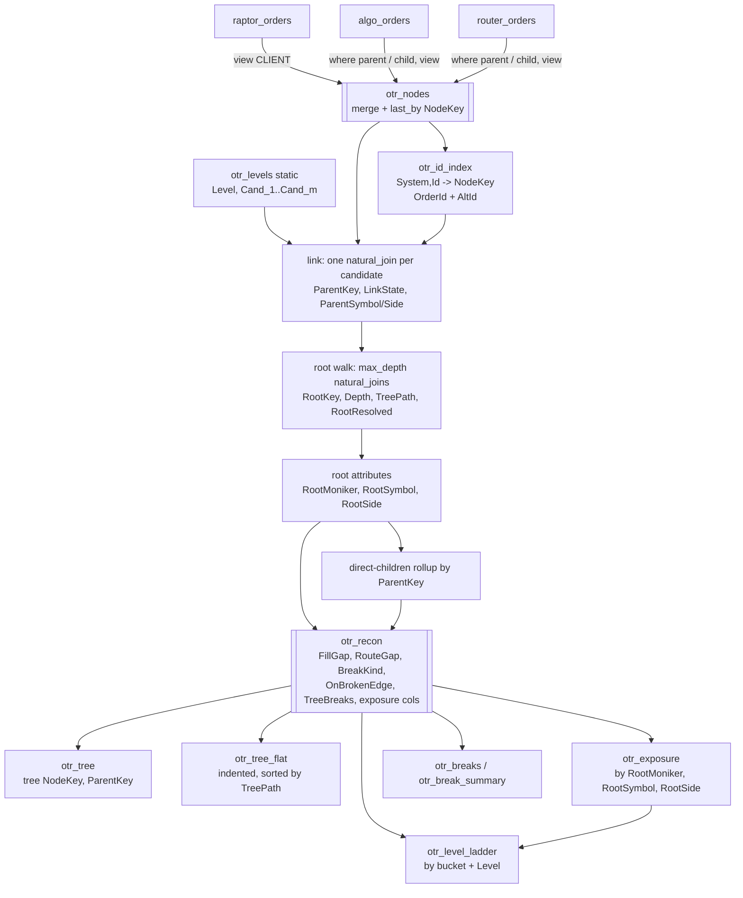

# 14 — Order tree reconciliation: Raptor → algo → order router (contract)

The question this answers:

> Orders flow from the **Raptor** FIX engine to an **algo server** (one parent, many
> children), and each algo child goes to an **order router** (which also has a parent and
> child orders on venues). Every downstream order carries an external order id from its
> upstream system. With all three systems' orders in Deephaven, what is the best way to
> show the **order tree** when I type a **moniker, symbol and side**, and to show the
> **reconciliation of each level's total `CumQty` and `LeavesQty`**, so I know the
> systems' exposure to **bought shares** and **open order shares**?

The submodule [`order-tree-recon/`](../order-tree-recon/) is the runnable answer. It runs
on mock Raptor / algo / router tables in their own native shapes, and every number in
this doc is checked against the real engine (section 10). This doc is **binding** for
that module the way docs 09 and 13 are for theirs: table names, column names and
formulas below are frozen, and a deviation updates this doc in the same change.

---

## 1. The answer in one screen

1. **Normalize, don't join pairwise.** Map each *level* (client order, algo parent,
   algo child, router parent, router child) onto one canonical **node** shape with one
   `view` per level, then `merge` them. Three systems and five levels become one table
   with one parent pointer per row. Pairwise joins (Raptor⋈algo, algo⋈router, …) can't
   handle DMA flow that skips a hop, and get worse with every system you add.
2. **Link through an id index, with ordered candidate systems.** `(System, Id) →
   NodeKey` over every id an order is known by. A level names the systems its parent
   may live in, in order: the router parent tries `ALGO` first, then `RAPTOR`, so DMA
   flow links without special cases.
3. **Find the root with bounded iterated joins.** One `natural_join` per level climbs
   the tree and yields `RootKey`, `Depth` and a depth-first `TreePath` for every node,
   incrementally. Anything deeper than the topology allows is flagged, not mis-rooted.
4. **Copy the root's moniker, symbol and side onto every node.** Only Raptor knows the
   moniker. Filtering on `RootMoniker`/`RootSymbol`/`RootSide` returns **whole trees**,
   all levels, for the moniker you type. Filtering each node on its own columns would
   lose every algo and router order (they carry no moniker) and tear the trees apart.
5. **Reconcile per edge, with signed gaps.** Compare each parent with the sum over its
   *direct* children: `FillGap = CumQty − ΣchildCumQty`,
   `RouteGap = LeavesQty − ΣchildLeavesQty`. The sign carries the meaning. More open
   below than above is over-exposure (red); less is just shares held (amber).
6. **Answer exposure per (moniker, symbol, side) and per level.** Client cum and leaves
   vs street cum and leaves, plus where the difference sits (held, over-routed,
   unbooked, phantom), with two identities that make the numbers add up (section 5.3).
7. **Show it as four panels on one filter:** an exposure table (one row per bucket), a
   level ladder, the native **tree table** (expand/collapse, recon columns on every
   node) and a breaks list. The tree only ships expanded rows to the browser, so the
   whole book needs no paging.

---

## 2. Topology: levels, systems, candidates

| Level | System (id namespace) | Parent may be in | Notes |
|---|---|---|---|
| `CLIENT` | `RAPTOR` | — (root) | the client order; the only level carrying the **moniker** |
| `ALGO_PARENT` | `ALGO` | `RAPTOR` | algo parent, links to Raptor's order id |
| `ALGO_CHILD` | `ALGO` | `ALGO` | algo slice, links to its algo parent (same namespace) |
| `OR_PARENT` | `OR` | `ALGO`, then `RAPTOR` | router parent; algo child id, or Raptor's id for **DMA** |
| `OR_CHILD` | `OR` | `OR` | venue order, **street** level: its open qty is market exposure |

`config.DEFAULT_LEVELS` holds exactly this list, and `config.parse_topology` validates
any other list (unique names, known parent systems, at least one root, a root can't be
the street level). Several levels can share a system: algo parents and children share
the `ALGO` namespace, which is why one `(System, Id)` index serves both the cross-system
hop (router parent → algo child) and the in-system hop (algo child → algo parent).

Tree depth is **data-driven**. A DMA tree is three levels deep and an algo tree five,
and an algo "sub-parent" (an algo child that has its own algo children) adds one more.
The root walk runs `max_depth = len(levels)` passes, which covers one nested algo level.
Anything deeper is `TOO_DEEP` (section 5.2).

## 3. The adapter contract — the only code you rewrite

Each level table handed to the DAG must carry `config.CANONICAL_COLUMNS`:

| Column | Type | Meaning |
|---|---|---|
| `OrderId` | string | this system's id for the order (unique within the system) |
| `AltId` | string | a second id a downstream system may reference (`""` if none) |
| `LinkId` | string | the id this order carries **for its parent**: the external order id for a cross-system hop, the parent order id inside a system, `""` at the root level |
| `Moniker` | string | client moniker; only the root level needs it |
| `Symbol`, `Side` | string | **one side coding across systems** (otherwise every child is a `MISMATCH`) |
| `OrderQty`, `CumQty`, `LeavesQty` | double | int/long are accepted, and nulls become `0.0` |
| `AvgPx` | double | null when nothing has filled |
| `Status`, `Destination` | string | display only (strategy for algo orders, venue for street orders) |

The mock adapters ([`sources.py`](../order-tree-recon/src/order_tree_recon/sources.py))
show every rule on purpose-built native shapes. Raptor uses FIX side codes and has both
`OrderId` and `ClOrdID`. The algo and router tables keep parents and children in one
table, with different column names:

```python
"CLIENT":      raptor.update_view([RAPTOR_SIDE]).view([
                   "OrderId", "AltId = ClOrdID", "LinkId = ``", "Moniker", "Symbol", "Side",
                   "OrderQty", "CumQty", "LeavesQty", "AvgPx", "Status = OrdStatus", "Destination = ``"]),
"ALGO_PARENT": algo.where("ParentAlgoOrderId == ``").view(["LinkId = RaptorOrderId", *algo_common]),
"ALGO_CHILD":  algo.where("!(ParentAlgoOrderId == ``)").view(["LinkId = ParentAlgoOrderId", *algo_common]),
"OR_PARENT":   router.where("ParentRouterOrderId == ``").view(["LinkId = UpstreamOrderId", *router_common]),
"OR_CHILD":    router.where("!(ParentRouterOrderId == ``)").view(["LinkId = ParentRouterOrderId", *router_common]),
```

Rules that matter in a real deployment:

- **Role split.** Use whatever parent/child flag your algo server and router really
  have. If an order matches two role filters, `last_by(NodeKey)` keeps the DAG alive,
  but the order shows up at only one level.
- **Which id a downstream system stores.** In the mock, the algo server stores Raptor's
  `OrderId` while DMA flow stamps Raptor's outbound `ClOrdID`. Index both (`AltId`), or
  the DMA router parents come out `ORPHAN`. If a system re-uses amend `ClOrdID`s (a
  cancel/replace rotates the id), feed the current *and* original id the way doc 09's
  id index covers every `ClOrdID` ever seen.
- **The input tables can be anything that is a Deephaven table**: Kafka, a JDBC poll
  (doc 07), parquet, or a remote URI from other servers (doc 10). The DAG is
  incremental, so ticking sources need no code change (section 10, live-fill test).

## 4. The DAG



The steps, as implemented in [`dag.py`](../order-tree-recon/src/order_tree_recon/dag.py):

**4.1 Canonicalize.** One `view` per level (nulls become `""` or `0.0`) stamps `Level`,
`LevelNo`, `System`, `IsStreet` and `NodeKey = System + "|" + OrderId`. Then
`merge(...).last_by("NodeKey")`. The `last_by` is cheap insurance: `natural_join` throws
on duplicate right keys, and one duplicated order must not take the whole DAG down.

**4.2 Id index.**

```python
by_order = nodes.where("OrderId != ``").view(["System", "Id = OrderId", "NodeKey"])
by_alt   = nodes.where("AltId != ``").view(["System", "Id = AltId", "NodeKey"])
otr_id_index = merge([by_order, by_alt]).last_by(["System", "Id"])
```

**4.3 Parent resolution.** `otr_levels` has one `Cand_i` column per candidate position
(`""` when a level has fewer candidates). One `natural_join` per position probes the
index, and the first hit wins:

```python
linked = nodes.natural_join(otr_levels, on=["Level"], joins=["IsRootLevel", "Cand_1", "Cand_2"])
linked = linked.natural_join(otr_id_index, on=["Cand_1=System", "LinkId=Id"], joins=["Hit_1=NodeKey"])
linked = linked.natural_join(otr_id_index, on=["Cand_2=System", "LinkId=Id"], joins=["Hit_2=NodeKey"])
linked = linked.update([
    "ParentKey = !isNull(Hit_1) ? Hit_1 : (!isNull(Hit_2) ? Hit_2 : ((String) null))",
    "LinkState = IsRootLevel ? `ROOT` : (LinkId == `` ? `NO_LINK` : (isNull(ParentKey) ? `ORPHAN` : `LINKED`))",
])
```

The parent's own `Symbol`/`Side` are joined back on `ParentKey` (a diamond, not a cycle)
for the `MISMATCH` check.

**4.4 Root walk.** `Up` is the next ancestor still to visit:

```python
walked = linked.update(["RootKey = NodeKey", "Depth = (int) 0", "TreePath = NodeKey", "Up = ParentKey"])
for _ in range(topology.max_depth):
    walked = walked.natural_join(parent_map, on=["Up=NodeKey"], joins=["NextUp=ParentKey"]).update([
        "TreePath = isNull(Up) ? TreePath : Up + ` > ` + TreePath",
        "RootKey  = isNull(Up) ? RootKey : Up",
        "Depth    = isNull(Up) ? Depth : Depth + 1",
        "Up       = isNull(Up) ? Up : NextUp"]).drop_columns(["NextUp"])
walked = walked.update(["RootResolved = isNull(Up)"])
```

The separator starts with a space, and a space sorts before every printable character,
so a plain `sort("TreePath")` is a **depth-first pre-order walk**: each parent sorts
immediately before its own subtree. That gives the indented flat tree for free.

**4.5 Root attributes.** `walked.view(["RootKey = NodeKey", "RootMoniker = Moniker",
"RootSymbol = Symbol", "RootSide = Side", "RootLevel = Level", "RootOrderId = OrderId",
"RootLinkState = LinkState"])`, natural-joined back on `RootKey`.

**4.6 Direct-children rollup.** `where("!isNull(ParentKey)").agg_by([count_("ChildCount"),
sum_(["ChildOrderQty = OrderQty", "ChildCumQty = CumQty", "ChildLeavesQty = LeavesQty"])],
by=["ParentKey"])`. Only **direct** children count. Comparing a node with its whole
subtree would count the mid levels twice (the rule doc 09 also follows).

**4.7 Recon, second pass, exposure columns.** These are the section 5 formulas. A
second join pulls the parent's "edge broke" flag down to its children (`OnBrokenEdge`),
and a per-`RootKey` sum gives `TreeBreaks`, so "breaks only" can keep whole trees.

Everything is a join or an aggregation. When a fill ticks on one venue order, only that
tree's rows recompute.

## 5. Reconciliation semantics

### 5.1 The two gaps (per node, against its direct children)

| | Non-street node | Street node |
|---|---|---|
| `FillGap` | `CumQty − ΣchildCumQty` (no children: `CumQty`) | `0` |
| `RouteGap` | `LeavesQty − ΣchildLeavesQty` (no children: `LeavesQty`) | `0` |

`HeldQty = max(RouteGap, 0)`, `OverRoutedQty = max(−RouteGap, 0)`,
`UnbookedQty = max(−FillGap, 0)`, `PhantomQty = max(FillGap, 0)`, all per node, then
summed. Positive and negative parts are summed separately, so an over-routed slice and
a held slice never cancel each other out.

### 5.2 The break taxonomy (priority order, first match wins)

| `BreakKind` | Condition | What it means for exposure | Colour |
|---|---|---|---|
| `ORPHAN` | `LinkId` set, resolves to nothing | the order (and everything under it) has no client attached; its street qty is **unattributed exposure** | red |
| `NO_LINK` | non-root level, empty `LinkId` | same, and the upstream system never stamped the id | red |
| `TOO_DEEP` | root not reached in `max_depth` passes (or a data cycle) | would otherwise inherit a blank moniker and vanish from searches | red |
| `MISMATCH` | `Symbol`/`Side` ≠ parent's | a child working the wrong instrument or direction | red |
| `OVERFILL` | `CumQty > OrderQty` | executed beyond the order size | red |
| `UNBOOKED_FILL` | `FillGap < 0` | children executed more than this order shows: **shares bought/sold that upstream has not booked** (missed or late execution report) | red |
| `PHANTOM_FILL` | `FillGap > 0` | this order shows fills its children don't explain (a bust that didn't propagate, an internal cross) | red |
| `CHILD_STILL_OPEN` | `RouteGap < 0` and own `LeavesQty = 0` | parent is done or canceled but a child is still working: **the cancel didn't propagate** | red |
| `OVER_ROUTED` | `RouteGap < 0` | more open below than above: **overfill risk** | red |
| `HELD` | `RouteGap > 0` | open here, not routed further (algo schedule, unrouted client order) | amber |
| `NONE` | edge reconciles | | — |

`UNBOOKED_FILL`, `PHANTOM_FILL`, `CHILD_STILL_OPEN` and `OVER_ROUTED` are **edge**
kinds: they are computed on the parent against its children, and the children get
`OnBrokenEdge = true` so both ends of the discrepancy light up.

**Why the gaps are signed.** Doc 09's taxonomy flags `abs(DeltaLeavesQty) > tol` as
amber `UNROUTED`. That is right for a pure "is the edge clean" view, but an exposure
view must split the two cases: shares sitting in the algo (fine) and more shares on the
street than the client wants (an overfill waiting to happen). Under `abs()` an over-route
is amber. Here it's red `OVER_ROUTED`, or `CHILD_STILL_OPEN` when the parent is already
closed. (Doc 09's blotter is unchanged. If its users care about over-routes, porting
the sign split means one more branch in its `BreakKind` formula plus the taxonomy constants.)

### 5.3 The identities: why the numbers add up

For a tree whose every node is linked (street nodes have no children), summing the
per-node gaps over the tree telescopes. Every non-root node's leaves appear once as a
child term and once as its own term:

```
ClientLeavesQty = Σ RouteGap + StreetLeavesQty = HeldQty − OverRoutedQty + StreetLeavesQty
ClientCumQty    = Σ FillGap  + StreetCumQty    ⇒  StreetCumQty − ClientCumQty = UnbookedQty − PhantomQty
```

So, per (moniker, symbol, side):

- **open order shares**: the client wants `ClientLeavesQty`. `StreetLeavesQty` of it is
  live on venues, `HeldQty` sits in Raptor/algo/router, and `OverRoutedQty` is working
  on the street *beyond* what the client has open;
- **bought (or sold) shares**: the street executed `StreetCumQty` and the client was
  booked `ClientCumQty`. The difference, `NetUnbookedQty`, is the firm's own position
  until booked, and `UnbookedQty`/`PhantomQty` say which edges created it.

Both identities are unit-tested on every complete bucket, and the embedded test asserts
the engine produces the same numbers (section 10). A bucket with an orphan doesn't
satisfy them by construction (the orphan's client is unknown), which is exactly why
unlinked trees are counted (`UnlinkedTrees`) and shown.

## 6. The exposure tables

**`otr_exposure`**: one row per `(RootMoniker, RootSymbol, RootSide)`:

| Column | Answers |
|---|---|
| `ClientOrderQty`, `ClientCumQty`, `ClientLeavesQty` | what the client asked for, was booked, still has open (Raptor, root orders only) |
| `StreetCumQty`, `StreetLeavesQty` | executed on venues, live on venues (`OR_CHILD`) |
| `NetUnbookedQty` | `StreetCumQty − ClientCumQty` — **bought/sold shares not on the client order** |
| `StreetOpenVsClient` | `StreetLeavesQty − ClientLeavesQty` — negative while shares are held upstream; **positive = more working on the street than the client wants** |
| `HeldQty`, `OverRoutedQty`, `UnbookedQty`, `PhantomQty` | where the differences sit |
| `Breaks`, `Trees`, `UnlinkedTrees`, `Orders` | red nodes, root count, roots that are not client orders |

**`otr_level_ladder`**: one row per bucket and level, with `Orders`, `OrderQty`,
`CumQty`, `LeavesQty`, `ExecNotional`, the four gap sums, `Breaks`, and
`CumVsClient`/`LeavesVsClient` (each level's total minus the bucket's client total).
This is the literal "each level's total" view. Read it with one caveat: level totals
only match the client when **all** flow passes through that level. DMA flow skips the
algo levels, so `ALGO_*` legitimately sums less. The per-edge gap columns are the
attribution that stays correct with DMA. The totals are the at-a-glance picture.

Example (scenario `unbooked_fill`, CEDAR / JPM / BUY):

```
Level        Orders OrderQty CumQty LeavesQty HeldQty UnbookedQty Breaks CumVsClient LeavesVsClient
CLIENT            1      900    800       100       0           0      0           0              0
ALGO_PARENT       1      900    800       100       0           0      0           0              0
ALGO_CHILD        3      900    800       100       0           0      0           0              0
OR_PARENT         3      900    800       100     100         100      1           0              0
OR_CHILD          3      900    900         0       0           0      0         100           -100
```

The street executed 900 and everything above it says 800: the router parent lost the
last fill report. The firm is long 100 shares the client doesn't have, and the client
order still shows 100 open that isn't open anywhere.

`Table.rollup` was rejected for the ladder. Its parent rows sum across children, so the
`Side` node of a `Moniker > Symbol > Side > Level` rollup would add the same shares
once per level (five times over). Ladder and exposure are flat aggregations instead.

## 7. The UI (`order_tree_dashboard`)

```
┌──────────────────────────────────────────────────────────────────────────────────┐
│ Moniker [du___v] Symbol [____v] Side [any v] Any order id [______] [x]unlinked [ ]breaks │
├────────────────────────────────────────┬─────────────────────────────────────────┤
│ Exposure by moniker / symbol / side    │ Level ladder                            │
│ (press a row to pin the bucket)        │                                         │
├────────────────────────────────────────┼─────────────────────────────────────────┤
│ Order tree — native, expand/collapse   │ Breaks in view                          │
│ ▾ CLIENT       RPT-00007  NONE         │ CHILD_STILL_OPEN OR_PARENT OR-00013 …   │
│   ▾ ALGO_PARENT ALG-00005 NONE         │                                         │
│     ▾ ALGO_CHILD …-01     NONE         │                                         │
│       ▾ OR_PARENT OR-00013 CHILD_STILL_OPEN  RouteGap −100                       │
│           OR_CHILD OR-00013.1 CANCELED                                           │
│           OR_CHILD OR-00013.2 PARTIALLY_FILLED  LeavesQty 100                    │
└────────────────────────────────────────┴─────────────────────────────────────────┘
```

- **One filter, four tables.** Moniker and symbol are type-in combo boxes fed by
  `otr_moniker_list`/`otr_symbol_list` with a case-insensitive **prefix** match, so
  typing `du` already shows DUNE. Side is a picker. All three match the **root's**
  attributes, and pressing an exposure row pins its exact bucket.
- **include unlinked** (default on) adds trees whose root isn't a client order (orphans)
  to a moniker search, as long as they match the symbol and side. An orphan router order
  can't inherit a moniker, and it is exactly the order a moniker search must not hide.
- **breaks only** keeps whole trees that contain a red node (`TreeBreaks > 0`), never
  isolated nodes.
- **Any order id** resolves an id from *any* system through `otr_id_index` and shows that
  whole tree, narrowing every panel to its bucket. You can start from a venue order id
  and see the client order.
- **Native tree table** (`Table.tree(NodeKey, ParentKey, promote_orphans=True)`) with
  `BreakKind`, the quantities and both gaps right after the order id. Formatting is
  applied before `.tree()` and survives it. `promote_orphans` matters: without it an
  orphan's venue subtree would vanish.
- **No hand-rolled paging.** Deephaven grids are viewport-virtualized, and a tree table
  only ships the rows of expanded nodes, so the whole book costs the browser one row
  per root. (Doc 09 hard-pages because its TODO asked for it. A tree doesn't need it.)
- `otr_tree_flat` is the same trees as a normal table: sorted by `TreePath`, with a
  `Tree` column indented by `Depth`. It pages, filters and row-presses like any table,
  and it is what `order_tree(...)["flat"]` and `find_tree(...)` return.

**A `deephaven.ui` lesson, found in the browser.** A combo box with a *controlled*
`input_value` round-trips every keystroke through the server, and a fast second
keystroke gets overwritten by the stale render (`du` showed up as `u`). The inputs are
therefore uncontrolled (`default_input_value` / `default_value`) with a `key` that is
bumped when a row press or *Clear* needs to set their text, which remounts them.

## 8. Query API (globals)

| Function | Returns |
|---|---|
| `order_tree(moniker=None, symbol=None, side=None, include_unlinked=True)` | `{"tree", "flat", "ladder", "exposure", "breaks"}`: exact match on each given value |
| `find_tree(any_id)` | the whole tree(s) containing an id from any system, as `otr_tree_flat` rows |
| `exposure(moniker=None, symbol=None, side=None)` | `otr_exposure` rows (with a moniker, unlinked buckets are not added) |

All values go through `sanitize_id` (doc 09's rules) before reaching a query string.

## 9. Configuration and deployment

| Variable | Default | Meaning |
|---|---|---|
| `OTR_QTY_TOL` | `1e-6` | absolute tolerance for every quantity comparison |
| `OTR_SEED` | `42` | mock data seed |
| `OTR_MOCK_FAMILIES` | `24` | random healthy families on top of the scenario catalog |

A malformed value is a startup error. The topology is code (`config.DEFAULT_LEVELS`),
not an environment variable, because it is coupled to the adapters.

- App folder `docker/apps/order-tree-recon/` (`.app` id `fix42.order.tree.recon`,
  `main.py` → shared loader → `/otr-scripts/order_tree_recon/app.py`).
- `docker/docker-compose.order-tree.yml`: one Deephaven service on the stock
  `ghcr.io/deephaven/server:42.4` image, no broker. `order-tree-recon/scripts/run_demo.sh
  [up|down|status|logs]` wraps it.
- Gradle: `include(":order-tree-recon")`. The module wraps its pytest suite like
  `:basket-oms-demo` (`base` plugin, `pytest` Exec task wired into `check`).

## 10. Verification

- **Reference oracle.** [`reference.py`](../order-tree-recon/src/order_tree_recon/reference.py)
  computes every `otr_recon` column, the ladder and the exposure table with dicts and
  loops. 81 host tests pin it down: every scenario's expected breaks, the edge taxonomy
  case by case, signed gaps, DMA via `AltId`, candidate order, nested algo, `TOO_DEEP`
  and cycles, depth-first `TreePath`, both identities on every complete bucket, the
  filter builders and the mock book's invariants.
- **Embedded engine** (`OTR_DH_TEST=1`, `deephaven-server==42.4`). The DAG matches the
  reference **row for row**: 340 nodes × 54 columns, 132 ladder rows, 29 exposure rows,
  zero differences. Also covered: tree, query API and app entrypoint. A **live-fill**
  test makes the router table a keyed input table and adds one venue fill the router
  parent never booked. The parent turns `UNBOOKED_FILL` and the bucket's
  `NetUnbookedQty` becomes 100 incrementally, with no rebuild.
- **Browser.** The app was loaded through the same loader path Application Mode uses
  and driven in headless Chromium: typing a prefix, pinning a bucket by row press,
  expanding a tree to the venue level, searching by a venue order id. The
  controlled-input bug in section 7 was found and fixed this way.

The scenario catalog ([`mockdata.py`](../order-tree-recon/src/order_tree_recon/mockdata.py)):

| Scenario | Bucket | Expected |
|---|---|---|
| `clean_filled` | ACME AAPL BUY | all `NONE` |
| `working` | ACME MSFT BUY | `HELD` on the algo parent (1 200 not yet released) |
| `dma` | BLUEFIN NVDA SELL | Raptor → router directly via `ClOrdID`, all `NONE` |
| `unrouted_client` | BLUEFIN AMZN BUY | `HELD` on the client order |
| `unbooked_fill` | CEDAR JPM BUY | `UNBOOKED_FILL` on one router parent, `NetUnbookedQty = 100` |
| `over_routed` | CEDAR AAPL SELL | `OVER_ROUTED`: two venue orders of 200 under a 300 router parent |
| `cancel_not_propagated` | DUNE MSFT BUY | `CHILD_STILL_OPEN`: everything canceled but one venue order with 100 open |
| `orphan` | (none) NVDA BUY | `ORPHAN` router parent: an unattributed bucket with 200 live on the street |
| `side_mismatch` | ACME NVDA BUY | `MISMATCH` on a SELL venue order under a BUY parent |
| `overfill` | BLUEFIN JPM SELL | `OVERFILL` on the router parent and `UNBOOKED_FILL` on the algo child that capped at its size |
| `nested_algo` | CEDAR NVDA BUY | an algo sub-parent, depth 5, all `NONE` |

## 11. Production notes

- **Transient gaps.** Fills propagate up the chain in milliseconds to seconds, so a
  live book shows short-lived `UNBOOKED_FILL`s. If that is noise, carry each system's
  last-update time through the adapters and flag a gap only once it is older than N
  seconds (`update_view` with `now()`, or a time-based `where` on a ticking clock).
  The structure doesn't change.
- **Internal fills.** An algo cross or a facilitation fill at a non-street level is a
  `PHANTOM_FILL` by construction (the fills don't come from the street). Model the
  internal book as its own street level (one more topology entry and adapter), or
  whitelist it.
- **Scale.** The DAG is a few `natural_join`s per level plus three aggregations. Memory
  is roughly the node table plus a handful of columns per node. For hundreds of millions
  of orders across servers, doc 10's split applies: leaves hold their systems' node
  tables, and a collector runs this DAG over the subscribed union.
- **Id collisions across namespaces** are harmless (the index is per system). Within one
  system, an `AltId` that equals another order's `OrderId` resolves to the `AltId` owner,
  so keep id schemes distinct.
- **Relationship to doc 09.** Doc 09 starts from FIX drop-copy tapes and folds them
  through a state machine. This module starts *after* that, from current-state order
  tables, wherever they come from. A doc 09 deployment can feed it by mapping
  `oms_orders_latest` per hub through adapters (`LinkId = ExtOrdID`).

## 12. Module layout

```
order-tree-recon/
├── README.md                    # runbook
├── build.gradle.kts / pyproject.toml / run_tests.sh
├── scripts/run_demo.sh          # podman compose up | down | status | logs
├── src/order_tree_recon/
│   ├── config.py                # pure: levels, topology validation, taxonomy, OTR_* env
│   ├── reference.py             # pure: the oracle of every DAG formula
│   ├── mockdata.py              # pure: native Raptor / algo / router tables + scenarios
│   ├── query_api.py             # pure filter builders + the console API
│   ├── sources.py               # native tables + per-level adapters  <- rewrite for real data
│   ├── dag.py                   # section 4
│   ├── dashboard.py             # section 7
│   └── app.py                   # Application-Mode entrypoint
└── tests/                       # host suite + the opt-in embedded-engine suite
```
